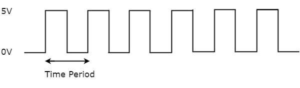
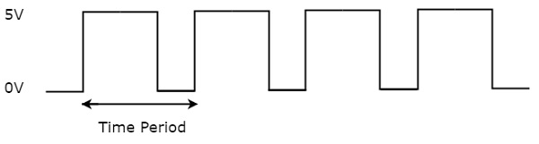
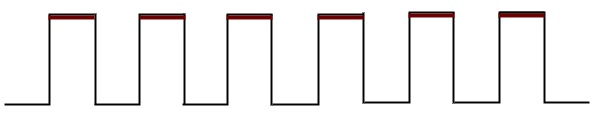
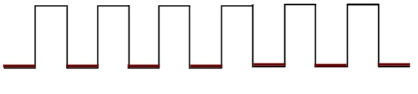
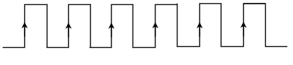
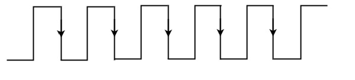

# Clock signal and triggering
{: .no_toc }

## Table of contents
{: .no_toc .text-delta }

1. TOC
{:toc}

---

## Clock signal

A Clock signal or a 'logic beat' is a periodic signal, oscillating between a high and a low state. It coordinates the actions of a digital circuit, telling it how and when to execute the programmed functions.

A clock signal is said to be in its 'ON' state when it oscillates at its high and in an 'OFF' state when it oscillates at its low. When the ON time of a clock signal is equal to its OFF time, the signal can be represented as a square wave as shown in the figure below. 

 
<strong><i>Figure:</i></strong> A clock signal represented by a square wave

In the above figure, the clock signal is represented as a square wave. This signal stays at logic High (5V) and at logic Low (0V) for an equal amount of time. This pattern repeats itself at a given time period, in this case, the time period is equal to either twice of ON time or twice of OFF time.

When the ON time of a clock signal is not equal to its OFF time, it can be represented as a train of pulses as shown in the figure below.

<strong><i>Figure:</i></strong> A clock signal represented by a train of pulses

In the above figure, the clock signal stays at logic High (5V) for some amount of time and stays at logic Low (0V) for some other amounf of time. This pattern repeats itself with a time period equal to twice the ON time or OFF time.

## Frequency of a clock signal

Frequency of a clock signal is calculated by taking the reciprocal of its time period. 

All sequential circuits are operated on a clock signal, and the frequency at which they can be operated is chosen based on the corresponding time period of the signal.

`Frequency = 1 / Time Period`

## Types of triggering

There are 2 possible types of triggering used in sequential circuits.

1. Level triggering
2. Edge triggering

### Level triggering

There are 2 levels, namely logic High and logic Low in clock signal. 

There are 2 types of level triggering:
1. Positive level triggering
2. Negative level triggering

#### Positive Level Triggering:
The type of triggering used when a sequential circuit is active when the clock signal is in the **Logic High** state, as depicted in the figure below.

<strong><i>Figure:</i></strong>The clock signal used for Postive Level Triggering

#### Negative Level Triggering:
The type of triggering used when a sequential circuit is active when the clock signal is in the **Logic Low** state, as depicted in the figure below.

<strong><i>Figure:</i></strong>The clock signal used for Negative Level Triggering

### Edge triggering

2 types of transitions occur in a clock signal, that is, the clock signal transitions either from logic low to logic high or vice verse, from logic high to logic low. They are categorised as follows:

1. Positive edge triggering
2. Negative edge triggering

#### Positive Edge Triggering

The type of edge triggering used when a sequential circuit is active only when the clock signal is transitioning from its logic low state to its logic high state. 

This type of triggering is also known as **rising edge triggering**, and is depicted in the figure below.

<strong><i>Figure:</i></strong>The clock signal used for Positive Edge Triggering

#### Negative Edge Triggering

The type of edge triggeting used when a sequential circuit is acitve only when the clock signal is transitioning from its logic high state to its logic low state.

This type of triggering is also known as **falling edge triggering**, and is depicted in the figure below.

<strong><i>Figure:</i></strong>The clock signal used for Negative Edge Triggering

