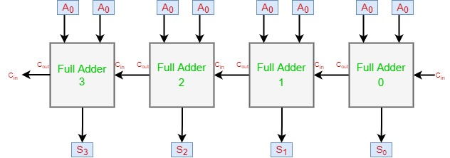
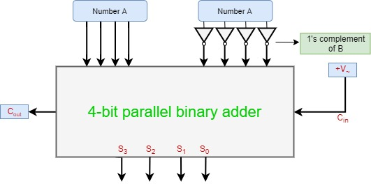

# N-Bit parallel adder
{: .no_toc }

## Table of contents
{: .no_toc .text-delta }

1. TOC
{:toc}

---

## Introduction

The Full Adder is capable of adding only two single-digit binary number along with a carry input. 
But in practice, you need to add binary numbers which are much longer than just one bit. To add two n-bit binary numbers you need to use the n-bit parallel adder. 
It uses several full adders in cascade. 
The carry output of the previous full adder is connected to carry input of the next full adder.

## 4-bit parallel adder
In the block diagram, A0 and B0 represent the LSB of the four-bit words A and B. 

Hence Full Adder-0 is the lowest stage. 
Hence its Cin has been permanently made 0. 
The rest of the connections are the same as those of n-bit parallel adder is shown in fig. The four-bit parallel adder is a very common logic circuit.

## Block diagram

# N-bit parallel subtractor

The subtraction can be carried out by taking the 1's or 2's complement of the number to be subtracted. 
For example, you can perform the subtraction (A-B) by adding either 1's or 2's complement of B to A. 
That means you can use a binary adder to perform the binary subtraction.

## 4-bit parallel subtractor

The number to be subtracted (B) is first passed through inverters to obtain its 1's complement. 
The 4-bit adder then adds A and 2's complement of B to produce the subtraction. 
S3 S2 S1 S0 represents the result of binary subtraction (A-B) and carry output Cout represents the polarity of the result. 
If A > B Cout = 0 and the result of binary form (A-B) then Cout = 1 and the result is in the 2's complement form.

## Block diagram

## 8-bit full adder and subtractor   

<iframe width="100%" height="400px" src="https://circuitverse.org/simulator/embed/2018" id="nbit_parallel_adder_subtractor_01" scrolling="no" webkitAllowFullScreen mozAllowFullScreen allowFullScreen> </iframe>