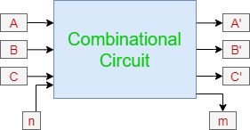

# Digital combinational circuits
{: .no_toc }

## Table of contents
{: .no_toc .text-delta }

1. TOC
{:toc}

## Introduction

Combinational circuits consist of Logic gates. These circuits operate with binary values. The output(s) of combinational circuit depends on the combination of present inputs. The following figure shows the **block diagram** of combinational circuit.

This combinational circuit has ‘n’ input variables and ‘m’ outputs. Each combination of input variables will affect the output(s).

## Design procedure of combinational circuits

1.  Find the required number of input variables and outputs from given specifications.   
1.  Formulate the Truth table. If there are ‘n’ input variables, then there will be 2n possible combinations. For each combination of input, find the output values.   
1.  Find the Boolean expressions for each output. If necessary, simplify those expressions.   
1.  Implement the above Boolean expressions corresponding to each output by using Logic gates.

## Sub-modules

In this module, we'll have a look at some combinational circuits. Feel free to check them out. 

1. [Half adder](https://learn.circuitverse.org/docs/Combinational/half_adder.html)
2. [Full adder](https://learn.circuitverse.org/docs/Combinational/full_adder.html)
3. [Half subtractor](https://learn.circuitverse.org/docs/Combinational/half_sub.html)
4. [Full subtractor](https://learn.circuitverse.org/docs/Combinational/full_sub.html)
5. [N-bit parallel adder and subtractor](https://learn.circuitverse.org/docs/Combinational/N-Bit%20Parallel%20Adder%20&%20Subtractor.html)