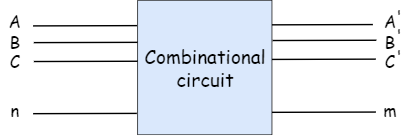

# Digital Combinational Circuits
{: .no_toc }

Combinational circuits are the circuits which contains Logic gates. These circuits operate with binary values ( 0 and 1 ). The output(s) of combinational circuit depends on the combination of present inputs. The figure which is given below shows the **block diagram** of combinational circuit.

This combinational circuit has takes ‘n’ inputs and gives ‘m’ outputs. Each combination of input variables will affect the output(s).

## Design procedure of Combinational circuits

1.  The no.of available input variables and required output variables are determined.   
2.  The input and output variables are assigned with some letter.
3.  Make a truth table to define the relationship between input and output. 
4.  Simplified boolean function from each output is obtained.
5.  Draw the logic diagram.
   
   
We're going to elaborate few important combinational circuits as follows.

