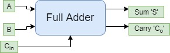
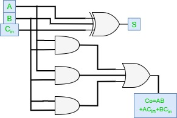

# Full adder
{: .no_toc }

## Table of contents
{: .no_toc .text-delta }

1. TOC
{:toc}

## Introduction

Full adder is developed to overcome the drawback of Half Adder circuit. 
It can add two one-bit numbers A and B, and carry c. 
The full adder is a three-input and two output combinational circuit.

## Block diagram

## Truth table

## Circuit diagram

## Full adder from 2 half adder

<iframe width="100%" height="400px" src="https://circuitverse.org/simulator/embed/247" id="full_adder_01" scrolling="no" webkitAllowFullScreen mozAllowFullScreen allowFullScreen> </iframe>

## Full adder from universal gates 

<iframe width="100%" height="400px" src="https://circuitverse.org/simulator/embed/45277" id="full_adder_02" scrolling="no" webkitAllowFullScreen mozAllowFullScreen allowFullScreen> </iframe>

## Ripple carry adder

<iframe width="100%" height="400px" src="https://circuitverse.org/simulator/embed/248" id="full_adder_03" scrolling="no" webkitAllowFullScreen mozAllowFullScreen allowFullScreen> </iframe>
