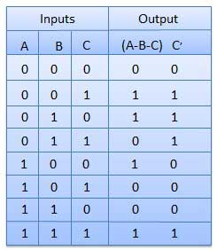
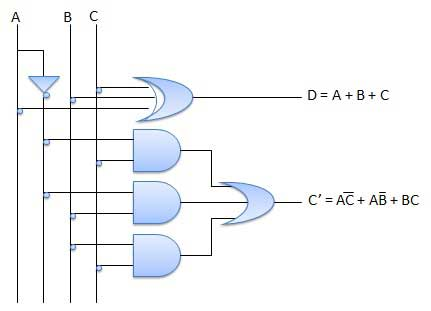

# Full subtractors
{: .no_toc }

## Table of contents
{: .no_toc .text-delta }

1. TOC
{:toc}

## Introduction

The disadvantage of a half subtractor is overcome by full subtractor. 
The full subtractor is a combinational circuit with three inputs A, B, C and two output D and C'. 
A is the 'minuend', B is 'subtrahend', C is the 'borrow' produced by the previous stage, D is the difference output and C' is the borrow output.

## Truth table

## Circuit diagram

<iframe width="100%" height="400px" src="https://circuitverse.org/simulator/embed/12119" id="full_sub_01" scrolling="no" webkitAllowFullScreen mozAllowFullScreen allowFullScreen> </iframe>

## Full subtractor from universal gates

<iframe width="100%" height="400px" src="https://circuitverse.org/simulator/embed/45278" id="full_sub_02" scrolling="no" webkitAllowFullScreen mozAllowFullScreen allowFullScreen> </iframe>