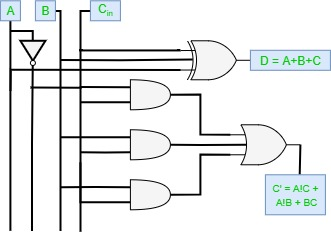

# Full Subtractors
{: .no_toc }

A full subtractor is a Combinational logic circuit made to overcome the disadvantage of half subtractor, with input of 3 single bit binary numbers, it is used for the subraction of 2 single bit binary numbers is subtracted from a higher 1 single bit binary number, it gives 2 outputs called **difference** and **borrow**.

Lets assume 3 single bit binary numbers as 'A', 'B', 'C'(Borrow produced in th previous stage), whose outputs are difference denoted by '(A-B-C)' or 'D', and thr borrow output is '(C')'. 

## Truth Table
{: .no_toc }

* Inputs: A, B, C
* Outputs: (A-B-C), C'

|    A    |    B    |    C    | (A-B-C) |    C'   |
|:-------:|:-------:|:-------:|:-------:|:-------:|
|    0    |    0    |    0    |    0    |    0    |
|    0    |    0    |    1    |    1    |    1    |
|    0    |    1    |    0    |    1    |    1    |
|    0    |    1    |    1    |    0    |    1    |
|    1    |    0    |    0    |    1    |    0    |
|    1    |    0    |    1    |    0    |    0    |
|    1    |    1    |    0    |    0    |    0    |
|    1    |    1    |    1    |    1    |    1    |

## Circuit Diagram
{: .no_toc }

<iframe width="100%" height="400px" src="https://circuitverse.org/simulator/embed/12119" id="projectPreview" scrolling="no" webkitAllowFullScreen mozAllowFullScreen allowFullScreen> </iframe>
