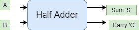
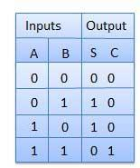

# Half adder
{: .no_toc }

## Table of contents
{: .no_toc .text-delta }

1. TOC
{:toc}

## Introduction

Half adder is a combinational logic circuit with two inputs and two outputs. 
The half adder circuit is designed to add two single bit binary number A and B. 
It is the basic building block for the addition of two single-bit numbers. 
This circuit has two outputs **carry** and **sum**.

## Block diagram

## Truth table

## Circuit diagram

<iframe width="100%" height="400px" src="https://circuitverse.org/simulator/embed/43463" id="half_adder_01" scrolling="no" webkitAllowFullScreen mozAllowFullScreen allowFullScreen> </iframe>

## Half adder from universal gates 

<iframe width="100%" height="400px" src="https://circuitverse.org/simulator/embed/101813" id="half_adder_02" scrolling="no" webkitAllowFullScreen mozAllowFullScreen allowFullScreen> </iframe>
