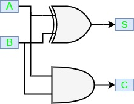

# Half Adder
{: .no_toc }

## Table of contents
{: .no_toc .text-delta }

1. TOC
{:toc}

## Introduction

Half adder is a combinational logic circuit with two inputs and two outputs. 
The half adder circuit is designed to add two single bit binary number A and B. 
It is the basic building block for the addition of two single-bit numbers. 
This circuit has two outputs **carry** and **sum**.

## Block Diagram

## Truth Table

## Circuit Diagram

<iframe width="100%" height="400px" src="https://circuitverse.org/simulator/embed/43463" id="projectPreview" scrolling="no" webkitAllowFullScreen mozAllowFullScreen allowFullScreen> </iframe>
