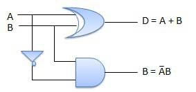

# Half subtractors
{: .no_toc }

## Table of contents
{: .no_toc .text-delta }

1. TOC
{:toc}

## Introduction

Half subtractor is a combination circuit with two inputs and two outputs (difference and borrow). 
It produces the difference between the two binary bits at the input and also produces an output (Borrow) to indicate if a 1 has been borrowed. 
In the subtraction (A-B), A is called a Minuend bit and B is called a Subtrahend bit.

## Truth table

## Circuit diagram

<iframe width="100%" height="400px" src="https://circuitverse.org/simulator/embed/12120" id="half_sub_01" scrolling="no" webkitAllowFullScreen mozAllowFullScreen allowFullScreen> </iframe>

## Half subtractor from universal gates 

<iframe width="100%" height="400px" src="https://circuitverse.org/simulator/embed/101817" id="half_sub_02" scrolling="no" webkitAllowFullScreen mozAllowFullScreen allowFullScreen> </iframe>
