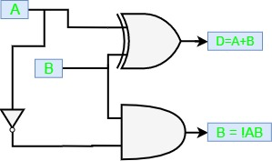

# Half Subtractors
{: .no_toc }

A half subtractor is a Combinational logic circuit with input of 2 single bit binary numbers, it is used for the subtraction of 2 single bit binary numbers, it gives an output The 2 single bit binary numbers are called **Minuend** and **Subtrahend** and it gives 2 outputs namely **difference** and **borrow**.

Lets assume 2 single bit binary numbers as 'A' and 'B', whose outputs are difference denoted by '(A-B)', and 'borrow'.  

## Truth Table
{: .no_toc }

* Inputs: A, B
* Outputs: (A-B), Borrow

|    A    |    B    |  (A-B)  |  Borrow |
|:-------:|:-------:|:-------:|:-------:|
|    0    |    0    |    0    |    0    |
|    0    |    1    |    1    |    1    |
|    1    |    0    |    1    |    0    |
|    1    |    1    |    0    |    0    |

## Circuit Diagram
{: .no_toc }

<iframe width="100%" height="400px" src="https://circuitverse.org/simulator/embed/12120" id="projectPreview" scrolling="no" webkitAllowFullScreen mozAllowFullScreen allowFullScreen> </iframe>
