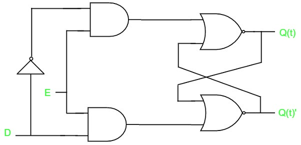

# D latch
{: .no_toc}

## Table of contents
{: .no_toc .text-delta }

1. TOC
{:toc}
 
## Introduction

There is one drawback of SR Latch. That is the next state value can’t be predicted when both the inputs S & R are one. So, you can overcome this difficulty by D Latch. It is also called as Data Latch. The circuit diagram of D Latch is shown in the following figure.

This circuit has single input D and two outputs Q(t) & Q(t)’. D Latch is obtained from SR Latch by placing an inverter between S amp;& R inputs and connect D input to S. That means the combinations, having same values, of S & R are eliminated. 

* If D = 0 → S = 0 & R = 1, then next state Q(t + 1) will be equal to ‘0’ irrespective of present state, Q(t) values. This is corresponding to the second row of SR Latch state table.

* If D = 1 → S = 1 & R = 0, then next state Q(t + 1) will be equal to ‘1’ irrespective of present state, Q(t) values. This is corresponding to the third row of SR Latch state table.

## State table

| D      | Q(t + 1)    |
|:------:|:-----:|
| 0      | 0     |
| 1      | 1     |

Therefore, D Latch Hold the information that is available on data input, D. That means the output of D Latch is sensitive to the changes in the input, D as long as the enable is High.

In this module, you implemented various Latches by providing the cross coupling between NOR gates. Similarly, you can implement these Latches using NAND gates.

<iframe width="100%" height="400px" src="https://circuitverse.org/simulator/embed/4276" id="d_latch_01" scrolling="no" webkitAllowFullScreen mozAllowFullScreen allowFullScreen> </iframe>