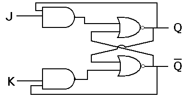

## JK Latch

JK latch is similar to RS latch. This latch consists of 2 inputs J and K as shown in the below figure. The ambiguous state has been eliminated here: when the inputs of Jk latch are high, then output toggles. The output feedback to inputs is the only difference we see here, which is not there in the RS latch.

| J      |    K    |   Q(t+1) |
|:------:|:-------:|:--------:|
|  0     |    0    |  Q(t)    |
|  0     |    1    |    0     |
|  1     |    0    |    1     |
|  1     |    1    |  Q(t)'   |

<iframe width="100%" height="400px" src="https://circuitverse.org/simulator/embed/93260" id="projectPreview" scrolling="no" webkitAllowFullScreen mozAllowFullScreen allowFullScreen> </iframe>


