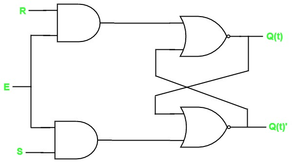

## SR Latch

SR Latch is also called as Set Reset Latch. This latch affects the outputs as long as the enable, E is maintained at ‘1’. The circuit diagram of SR Latch is shown in the following figure.

This circuit has two inputs S & R and two outputs Q(t) & Q(t)’. The **upper NOR gate** has two inputs R & complement of present state, Q(t)’ and produces next state, Q(t+1) when enable, E is ‘1’.
Similarly, the **lower NOR gate** has two inputs S & present state, Q(t) and produces complement of next state, Q(t+1)’ when enable, E is ‘1’.

A 2-input NOR gate produces an output, which is the complement of another input when one of the input is ‘0’. Similarly, it produces ‘0’ output, when one of the input is ‘1’.

* If S = 1, then next state Q(t + 1) will be equal to ‘1’ irrespective of present state, Q(t) values.

* If R = 1, then next state Q(t + 1) will be equal to ‘0’ irrespective of present state, Q(t) values.

At any time, only of those two inputs should be ‘1’. If both inputs are ‘1’, then the next state Q(t + 1) value is undefined.

The following table shows the state table of **SR latch**.

| S      |    R    |   Q(t+1) |
|:------:|:-------:|:--------:|
|  0     |    0    |  Q(t)    |
|  0     |    1    |    0     |
|  1     |    0    |    1     |
|  1     |    1    |    -     |

Therefore, SR Latch performs three types of functions such as Hold, Set & Reset based on the input conditions.

<iframe width="100%" height="400px" src="https://circuitverse.org/simulator/embed/13774" id="projectPreview" scrolling="no" webkitAllowFullScreen mozAllowFullScreen allowFullScreen> </iframe>