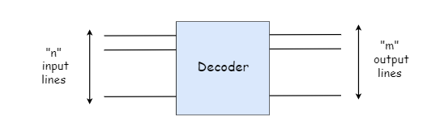
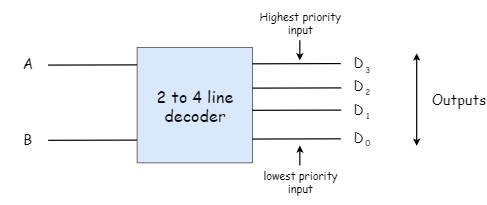

# Decoder
{: .no_toc }

A decoder is a multi-input, multi-output logic circuit which decodes n inputs 2n possible outputs.
Decoder is identical to a demultiplexer without any data input. 
The operation of a decoder is exactly opposite to that of encoder.

## Block Diagram
{: .no_toc }

### Examples of Decoders are following.
   
* Code converters
* BCD to seven segment decoders
* Nixie tube decoders
* Relay actuator

## 2 to 4 Line Decoder
{: .no_toc }

The block diagram of 2 to 4 line decoder is shown in the fig below. 
A and B are the two inputs where D through D are the four outputs. 
Truth table which is given below will explain the operations of a decoder. 
It shows that each output is 1 only for a specific combination of inputs.

## Block Diagram
{: .no_toc }

## Truth Table

## Logic Circuit

<iframe width="100%" height="400px" src="https://circuitverse.org/simulator/embed/763" id="projectPreview" scrolling="no" webkitAllowFullScreen mozAllowFullScreen allowFullScreen> </iframe>
