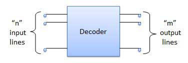
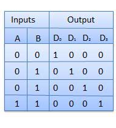

# Decoders
{: .no_toc }

1. TOC
{:toc}

## Introduction

A decoder is a combinational circuit. 
It has n input and to a maximum m = 2n outputs. 
Decoder is identical to a demultiplexer without any data input. 
It performs operations which are exactly opposite to those of an encoder.

## Block Diagram

### Examples of Decoders ::
   
* Code converters
* BCD to seven segment decoders
* Nixie tube decoders
* Relay actuator

## 2 to 4 Line Decoder

The block diagram of 2 to 4 line decoder is shown in the fig. 
A and B are the two inputs where D through D are the four outputs. 
Truth table explains the operations of a decoder. 
It shows that each output is 1 for only a specific combination of inputs.

## Block Diagram

## Truth Table

## Logic Circuit

<iframe width="100%" height="400px" src="https://circuitverse.org/simulator/embed/763" id="projectPreview" scrolling="no" webkitAllowFullScreen mozAllowFullScreen allowFullScreen> </iframe>
