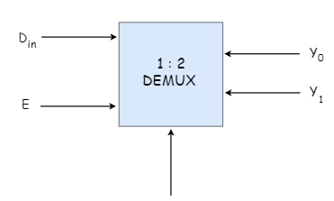

# Demultiplexers
{: .no_toc }

The operation of a demultiplexer is the reverse of multiplexers that is, it receives one input and distributes it over several outputs. 
It has only one input, n outputs and m select inputs. 
At a time only one output line is selected by the select lines and the input is transmitted to the selected output line. 
A de-multiplexer is equivalent to a single pole multiple way switch as shown in the figure below.

## Demultiplexers in multiple variations.

* 1 : 2  demultiplexer
* 1 : 4  demultiplexer
* 1 : 16 demultiplexer
* 1 : 32 demultiplexer

## Block Diagram
{: .no_toc }

## Truth Table
{: .no_toc }

<iframe width="100%" height="400px" src="https://circuitverse.org/simulator/embed/756" id="projectPreview" scrolling="no" webkitAllowFullScreen mozAllowFullScreen allowFullScreen> </iframe>
