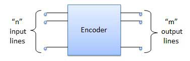
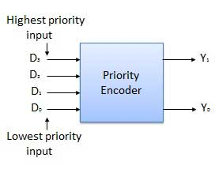
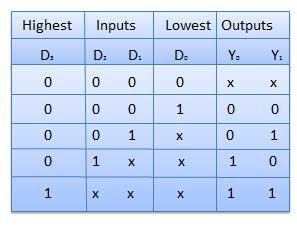

# Encoder
{: .no_toc }

1. TOC
{:toc}

## Introduction

Encoder is a combinational circuit which is designed to perform the inverse operation of the decoder. 
An encoder has n number of input lines and m number of output lines. An encoder produces an m bit binary code corresponding to the digital input number. 
The encoder accepts an n input digital word and converts it into an m bit another digital word.

## Block diagram

### Examples of encoders ::
   
* Priority encoders
* Decimal to BCD encoder
* Octal to binary encoder
* Hexadecimal to binary encoder

## Priority encoder

This is a special type of encoder. 
Priority is given to the input lines. 
If two or more input line are 1 at the same time, then the input line with highest priority will be considered. 
There are four input D0, D1, D2, D3 and two output Y0, Y1. 
Out of the four input D3 has the highest priority and D0 has the lowest priority. 
That means if D3 = 1 then Y1 Y1 = 11 irrespective of the other inputs. Similarly if D3 = 0 and D2 = 1 then Y1 Y0 = 10 irrespective of the other inputs.

## Block diagram

### Truth table

### Logic circuit

<iframe width="100%" height="400px" src="https://circuitverse.org/simulator/embed/762" id="encoder_01" scrolling="no" webkitAllowFullScreen mozAllowFullScreen allowFullScreen> </iframe>

## Decimal to BCD encoder

The Decimal to Binary Encoder usually consists of 10 input lines and 4 output lines. The input is a number written in base 10 and the output is its corresponding equivalent binary coded decimal number (of 4 bits). 

## Octal to binary encoder

The Octal to Binary Encoder encoder usually consists of 8 inputs lines and 3 outputs lines. The input is a number written in base 8 and the output is its corresponding equivalent number in base 2.

## Hexadecimal to binary encoder

The Hexadecimal to Binary Encoder encoder usually consists of 16 inputs lines and 3 outputs lines. The input is a number written in base 16 and the output is its corresponding equivalent number in base 2.