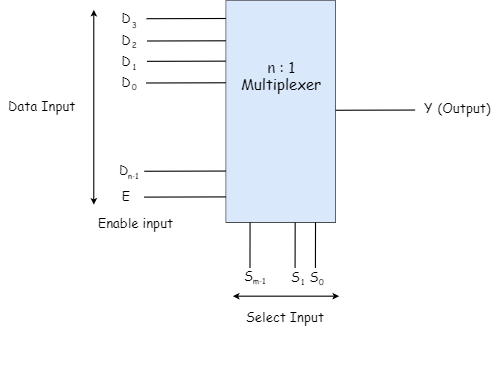

# Multiplexers
{: .no_toc }

Multiplexer is a special type of combinational circuit which is used to select only one input among several inputs based on selection lines. It is also called as Data selector.
There are n-data inputs, 1 output and m select inputs with 2m = n. 
Depending on the digital code applied at the selected inputs, 1 out of n data sources is selected and transmitted to the single output Y. 
E is called the strobe or enable input which is useful for the cascading. It is generally an active low terminal i.e, it will perform the required operation when it is low.

## Block Diagram
{: .no_toc }

## Multiplexers come in multiple variations
   
* 2 : 1 multiplexer
* 4 : 1 multiplexer
* 16 : 1 multiplexer
* 32 : 1 multiplexer

## Truth Table
{: .no_toc }

<iframe width="100%" height="400px" src="https://circuitverse.org/simulator/embed/746" id="projectPreview" scrolling="no" webkitAllowFullScreen mozAllowFullScreen allowFullScreen> </iframe>
