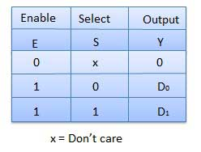

# Multiplexers
{: .no_toc }

1. TOC
{:toc}

## Introduction

Multiplexer is a special type of combinational circuit. 
There are n-data inputs, one output and m select inputs with 2m = n. 
It is a digital circuit which selects one of the n data inputs and routes it to the output. 
The selection of one of the n inputs is done by the selected inputs. Depending on the digital code applied at the selected inputs, one out of n data sources is selected and transmitted to the single output Y. 
E is called the strobe or enable input which is useful for the cascading. It is generally an active low terminal that means it will perform the required operation when it is low.

## Block Diagram

## Multiplexers come in multiple variations
   
### 2 : 1 multiplexer
#### Truth Table

<iframe width="100%" height="400px" src="https://circuitverse.org/simulator/embed/746" id="projectPreview" scrolling="no" webkitAllowFullScreen mozAllowFullScreen allowFullScreen> </iframe>

### 4 : 1 multiplexer
The 4 : 1 multiplexer has 4 inputs and 2 control signals.
<iframe width="100%"  height="400px" src="https://circuitverse.org/simulator/embed/44747" id="projectPreview" scrolling="no" webkitAllowFullScreen mozAllowFullScreen allowFullScreen> </iframe>

### 8 : 1 multiplexer
The 8 : 1 multiplexer has 8 inputs and 3 control signals.
<iframe width="100%"  height="400px" src="https://circuitverse.org/simulator/embed/44766" id="projectPreview" scrolling="no" webkitAllowFullScreen mozAllowFullScreen allowFullScreen> </iframe>

You can implement a 8 : 1 multiplexer by chaining **two** 4 : 1 multiplexers, like this:
<iframe width="100%" height="400px" src="https://circuitverse.org/simulator/embed/44784" id="projectPreview" scrolling="no" webkitAllowFullScreen mozAllowFullScreen allowFullScreen> </iframe>

### 16 : 1 multiplexer
The 16 : 1 multiplexer has 16 inputs and 4 control signals.

It can be implemented with **two** 8 : 1 multiplexers:

<iframe width="100%" height="400px" src="https://circuitverse.org/simulator/embed/44795" id="projectPreview" scrolling="no" webkitAllowFullScreen mozAllowFullScreen allowFullScreen> </iframe>

It can also be implemented with **five** 4 : 1 multiplexers:
<iframe width="100%" height="400px" src="https://circuitverse.org/simulator/embed/44804" id="projectPreview" scrolling="no" webkitAllowFullScreen mozAllowFullScreen allowFullScreen> </iframe>



