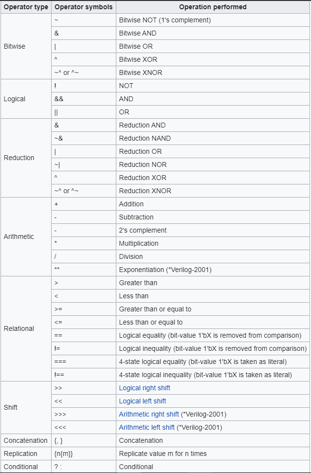

# An Introduction to Verilog Programming
{: .no_toc }

---

## Overview
Verilog, which was standardized as IEEE 1364, is a hardware description language (HDL) used to model electronic systems. 
It is used in the simulation and verification of digital circuits at the register-transfer level of abstraction. It is used in the verification of analog circuits,  mixed-signal circuits, and in the design of genetic circuits. In 2009, the Verilog standard was merged into the SystemVerilog standard, creating IEEE Standard 1800-2009. Since then, Verilog is officially a subset of the SystemVerilog language. The current version is IEEE standard 1800-2017

Verilog is an acronym for Verifying Logic. It was created by Gateway Automation in 1984. Cadence acquired Gateway in 1990. With the increasing success of VHDL at the time, Cadence decided to make the language available for open standardization. 
It transferred Verilog into the public domain under the Open Verilog International Organization called as  Accellera. Verilog was later submitted to IEEE and became the IEEE Standard 1364 in 1995, now known as Verilog-95.

Verilog supports a design at many levels of abstraction. The primary three are −
- **Behavioral level**
- **Register-transfer level**
- **Gate level**

The language is also pretty simple, only requires knowledge of digital logic, and it has syntax similar to C. Verilog is case sensitive. All the key words are in lower case. Verilog uses ".V" file extensions.

Example of an AND gate using Verilog is:
``` Verilog
module andgate (a, b, y);
	input a, b;
	output y;
	assign y = a & b;
endmodule
```

## Operators
Note: These operators are not shown in order of precedence.


<div style="text-align:center"></div>
