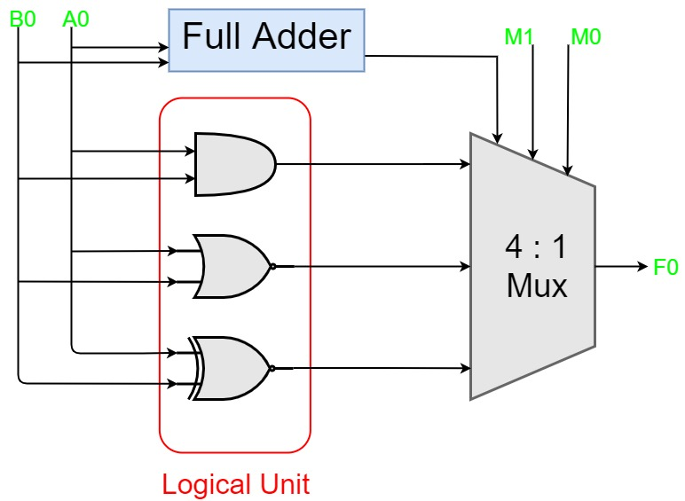
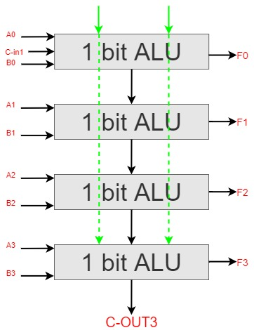

# ALU
{: .no_toc }

## Table of contents
{: .no_toc .text-delta }

1. TOC
{:toc}

---

## Introduction
An arithmetic logic unit (ALU) is a digital circuit which is utilised to perform arithmetic and logic operations. It represents the principle building block of the central processing unit (CPU) of a computer. Present-day CPUs contain very powerful and complex ALUs. In addition to ALUs, present-day CPUs contain a control unit (CU).

ALU is used to perform mathematical operations such as addition ( + ), subtraction ( - ), multiplication ( * ) and division ( / ) and basic logical operations like AND/OR calculations. It serves as the computational hub of the Central Processing Unit (CPU) for a computer system.

## In Detail
With the half adder and full adder discussed in Combinational Analysis, lets construct a simple ALU that performs  arithmetic operation (1 bit addition)and does 3 logical operations namely AND, NOR and XOR as shown below. The multiplexer chooses just a single activity at once. The activity chose relies upon the selection lines of the multiplexer as shown in the below truth table.

**Input = M1,M0 & 
Output = Operation**

|M1	|M0	|Operation|
|:-:|:-:|:-------:|
|0	|0	|SUM|
|1	|0	|AND|
|0	|1	|OR|
|1	|1	|XOR|

Presently we can take up the 1 piece ALU as a block and develop a 4 piece ALU, which performs all the functions of the 1 bit ALU on the 4 bit inputs. In this way, a single building block can be constructed and utilised recursively. The inputs A and B are four bits and the output is four bit as well. Figure below illustrates it:

There are a couple of significant takeaways here:
* The selection lines MO and M1 select the function ALU performs. These selection lines combined with the input arguments and desired functions a Instruction Set can be formed.
* These Instructions can used to create meaningful programs. Since these are required to be easily available they can be stored on ROM unit.
* The input arguments A and B are often stored in Internal Registers. These along with other special purpose register form the registers of the microcontroller.
* ROM memories are slower in speed, hence an intermediate high speed RAM is often used.
* All the critical timings, decoding of the instructions are often grouped together in seperate control and timings unit'
* If a Micro controller would be constructed only from ALU, RAM, ROM there would not be any external interface. Hence we have Input/Output IO ports.
* Additional features such as 'Interrupts, communication protocols, EEPROM, Timers/Counters, Debug interfaces etc are incorporated to make a controller complete.

In above discussion we may have forgotten about the intricate details involved in a ALU, CPU design. Yet, the point was to comprehend ALU/CPU at a deeper level. 



