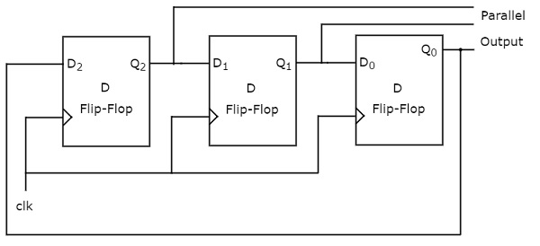
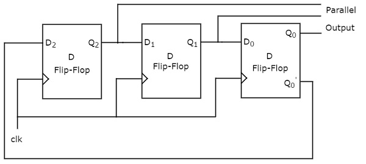

# Application of Shift Registers

In previous module, we discussed four types of shift registers. Based on the requirement, we can use one of those shift registers. Following are the applications of shift registers.

* Shift register is used as **Parallel to serial converter**, which converts the parallel data into serial data. It is utilized at the transmitter section after Analog to Digital Converter (ADC) block.
* Shift register is used as **Serial to parallel converter**, which converts the serial data into parallel data. It is utilized at the receiver section before Digital to Analog Converter (DAC) block.
* Shift register along with some additional gate(s) generate the sequence of zeros and ones. Hence, it is used as **sequence generator**.
* Shift registers are also used as **counters**. There are two types of counters based on the type of output from right most D flip-flop is connected to the serial input. Those are Ring counter and Johnson Ring counter.

In this module, let us discuss about these two counters one by one.

## Table of contents
{: .no_toc .text-delta }

1. TOC
{:toc}

---

## Ring Counter
In previous module, we discussed the operation of Serial In - Parallel Out (SIPO) shift register. It accepts the data from outside in serial form and it requires ‘N’ clock pulses in order to shift ‘N’ bit data.

Similarly, ‘N’ bit Ring counter performs the similar operation. But, the only difference is that the output of rightmost D flip-flop is given as input of leftmost D flip-flop instead of applying data from outside. Therefore, Ring counter produces a sequence of states (pattern of zeros and ones) and it repeats for every ‘N’ clock cycles.

The block diagram of 3-bit Ring counter is shown in the following figure.

The 3-bit Ring counter contains only a 3-bit SIPO shift register. The output of rightmost D flip-flop is connected to serial input of left most D flip-flop.

Assume, initial status of the D flip-flops from leftmost to rightmost is Q2Q1Q0=001. Here, Q2 & Q0 are MSB & LSB respectively. We can understand the working of Ring counter from the following table.

|No of positive edge of Clock|	Serial Input = Q0 |	Q2(MSB) |	Q1	 |Q0(LSB)|
|:--------------------------:|:------------------:|:-------:|:------:|:-----:|
|0	|-	|0	|0	|1  |
|1	|1	|1	|0	|0  |
|2	|0	|0	|1	|0  |
|3	|0	|0	|0	|1  |

The initial status of the D flip-flops in the absence of clock signal is Q2Q1Q0=001. This status repeats for every three positive edge transitions of clock signal.

Therefore, the following operations take place for every positive edge of clock signal.

Serial input of first D flip-flop gets the previous output of third flip-flop. So, the present output of first D flip-flop is equal to the previous output of third flip-flop.

The previous outputs of first and second D flip-flops are right shifted by one bit. That means, the present outputs of second and third D flip-flops are equal to the previous outputs of first and second D flip-flops.

## Johnson Ring Counter
The operation of Johnson Ring counter is similar to that of Ring counter. But, the only difference is that the complemented output of rightmost D flip-flop is given as input of leftmost D flip-flop instead of normal output. Therefore, ‘N’ bit Johnson Ring counter produces a sequence of states (pattern of zeros and ones) and it repeats for every ‘2N’ clock cycles.

Johnson Ring counter is also called as Twisted Ring counter and switch tail Ring counter. The block diagram of 3-bit Johnson Ring counter is shown in the following figure.

The 3-bit Johnson Ring counter also contains only a 3-bit SIPO shift register. The complemented output of rightmost D flip-flop is connected to serial input of left most D flip-flop.

Assume, initially all the D flip-flops are cleared. So, Q2Q1Q0=000. Here, Q2 & Q0 are MSB & LSB respectively. We can understand the working of Johnson Ring counter from the following table.

|No of positive edge of Clock|	Serial Input = Q0 |	Q2(MSB) |	Q1   |cQ0(LSB)|
|:--------------------------:|:------------------:|:-------:|:------:|:------:|
|0	|-	|0	|0	|0  |
|1	|1	|1	|0	|0  |
|2	|1	|1	|1	|0  |
|3	|1	|1	|1	|1  |
|4	|0	|0	|1	|1  |
|5	|0	|0	|0	|1  |
|6	|0	|0	|0	|0  |

The initial status of the D flip-flops in the absence of clock signal is Q2Q1Q0=000. This status repeats for every six positive edge transitions of clock signal.

Therefore, the following operations take place for every positive edge of clock signal.

Serial input of first D flip-flop gets the previous complemented output of third flip-flop. So, the present output of first D flip-flop is equal to the previous complemented output of third flip-flop.

The previous outputs of first and second D flip-flops are right shifted by one bit. That means, the present outputs of second and third D flip-flops are equal to the previous outputs of first and second D flip-flops.


