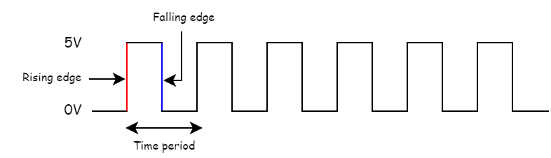
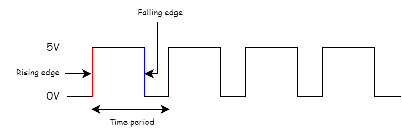
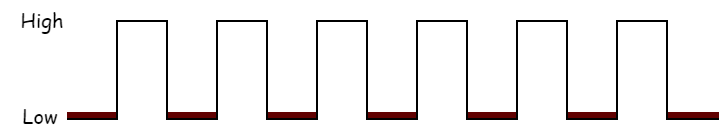
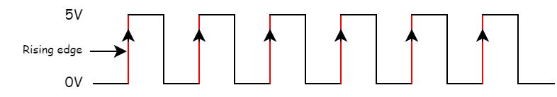
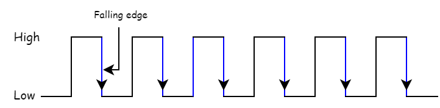

# Clock Signal and Triggering
{: .no_toc }

In this section, let us discuss about the clock signal and types of triggering one by one.

## Table of contents
{: .no_toc .text-delta }

1. TOC
{:toc}

---

## Clock signal

A clock signal is a periodic signal that goes from low to high and again low and it repeats.
The clock signal has a duty cycle equal to 50%.
We can represent the clock signal as a square wave, when both its ON time and OFF time are same. 
This clock signal is shown in the following figure.

In the above figure, the square wave is considered as clock signal. The time for which the clock stays high (5V) is equal to the time for which it stays low (0V). This pattern repeats again with a time period (T). In this case, the time period will be equal to either twice of ON time or twice of OFF time.

We can represent the clock signal as train of pulses, when ON time and OFF time are not same. This clock signal is shown in the following figure.

In the above figure, train of pulses is considered as clock signal. The time for which the clock stays high (5V) is not equal to the time for which it stays low (0V). This pattern repeats again with a time period (T). In this case, the time period will be equal to sum of ON time and OFF time.

Frequency (f) of a Clock signal is equal to the reciprocal of its Time period (T).
  f = 1/T  
All sequential circuits are operated with clock signal. So, the frequency at which the sequential circuits can be operated accordingly the clock signal frequency has to be chosen.

## Types of Triggering

Following are the two possible types of triggering that are used in sequential circuits.

* Level triggering
* Edge triggering

### Level triggering

There are two levels, namely logic High and logic Low in clock signal. Following are the two types of **level triggering**.

* Positive level triggering
* Negative level triggering

The type of triggering in which the clock signal is operated when it is in **Logic High** is called a **Positive level triggering**. It is highlighted in below figure.

The type of triggering in which the clock signal is operated when it is in **Logic Low** is called a **Negative level triggering**. It is highlighted in the following figure.

### Edge triggering

There are two types of transitions that occur in clock signal. That means, the clock signal transitions either from Logic Low to Logic High or Logic High to Logic Low.

Following are the two types of edge triggering based on the transitions of clock signal.

* Positive edge triggering
* Negative edge triggering

The type of triggering in which the clock signal is operated when it goes from **Logic Low** to **Logic High** is called as **Positive edge triggering**. It is also called as **rising edge triggering**. It is shown in the following figure.

The type of triggering in which the clock signal is operated when it goes from **Logic High** to **Logic Low** is called as **Negative edge triggering**. It is also called as **falling edge triggering**. It is shown in the following figure.


