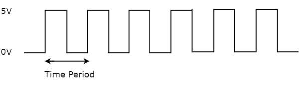
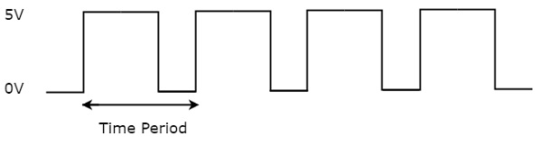
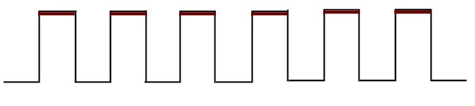
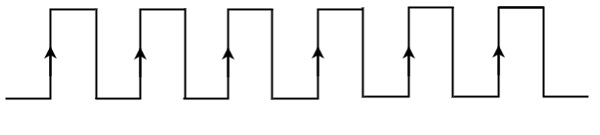

# Clock Signal and Triggering
{: .no_toc }

In this module, We will discuss about- The clock signal and also each of the types of triggering.

## Table of contents
{: .no_toc .text-delta }

1. TOC
{:toc}

---


## Clock Signal

The Clock Signal is a periodic signal. Its ON and OFF times need not be equal.
When both of its ON and OFF times are equal, it can be represented as a square wave.

<div style="text-align:center"></div>

The square wave in the above image is considered as a clock signal. In digital signals, this wave oscillates at High(1), and at Low(0) together for the same time period. The ON and OFF times are equal, so the time period of the oscillation is equal to twice to that of ON time or OFF time.
```yaml
Time period = (ON time) + (OFF time) = 2 * (ON time) = 2 * (OFF time)
```
NOTE: The time-period is considered only for one oscillation, i.e., from one rising edge till the start of the next rising edge.

When the ON and OFF times are not equal, the clock signal can be shown as the following figure.

<div style="text-align:center"></div>

The train of pulses in the above image is considered as a clock signal.  In digital signals, this wave remains at High(1) for some time and remains at Low(0) for some other time. This pattern repeats with some time period which is equal to sum of ON and OFF times.

The clock signal's frequency is equal to the reciprocal of the time period of that wave. Clock signals are used to operate all sequential circuits. The clock signal's frequency is chosen with respect to the frequency of the sequential circuits at which they are operated.

---

## Types of Triggering

There are 2 types of triggering which can be used in sequential circuits:

1. Level triggering
1. Edge triggering

### Level triggering

There are 2 levels in clock signal:

1. Logic High. 
1. Logic Low. 

There are the two types of **level triggering**.

1. Positive level triggering.
1. Negative level triggering.

### Positive level triggering

**Positive level triggering** happens when the clock signal of the sequential circuit is at logic high, which is highlighted in the below figure-

<div style="text-align:center"></div>

### Negative level triggering

**Negative level triggering** happens when the clock signal of the sequential circuit is at logic low, which is highlighted in the below figure-

<div style="text-align:center"></div>

### Edge triggering

There are 2 types of transitions which can occur in clock signals which transits either from Logic High to Logic low or from Logic Low to Logic High.

There are 2 types of edge triggering, which are based on the transitions occured in clock signals:

1. Positive edge triggering
1. Negative edge triggering

### Positive edge triggering

**Positive edge triggering** or **rising edge triggering** happens when the clock signal of the sequential circuit is transiting from logic Low to logic High, which is shown in the below figure.

<div style="text-align:center"></div>

### Negative edge triggering

**Negative edge triggering** or **falling edge triggering** happens when the clock signal of the sequential circuit is transiting from logic High to logic Low, which is shown in the below figure.

<div style="text-align:center"></div>




