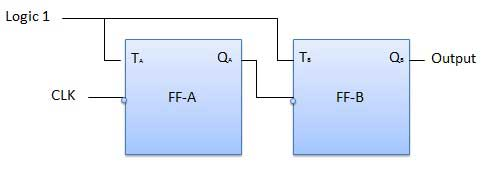

# Digital Sequential Circuits
{: .no_toc }

Counter is a sequential circuit. 
A digital circuit which is used for a counting pulses is known counter. 
Counter is the widest application of flip-flops. 
It is a group of flip-flops with a clock signal applied. 
Counters are of two types.

## Table of contents
{: .no_toc .text-delta }

1. TOC
{:toc}

---

## Asynchronous or ripple counters

The logic diagram of a 2-bit ripple up counter is shown in figure. 
The toggle (T) flip-flop are being used. 
But we can use the JK flip-flop also with J and K connected permanently to logic 1. 
External clock is applied to the clock input of flip-flop A and QA output is applied to the clock input of the next flip-flop i.e. FF-B.

### Logical Diagram

### Operation

|Condition|Operation|
|:--------|:--------|
|**Initially let both the FFs be in the reset state**|QBQA = 00 initially.|
|**After 1st negative clock edge**|As soon as the first negative clock edge is applied, FF-A will toggle and QA will be equal to 1.QA is connected to clock input of FF-B. Since QA has changed from 0 to 1, it is treated as the positive clock edge by FF-B. There is no change in QB because FF-B is a negative edge triggered FF.QBQA = 01 after the first clock pulse.|
|**After 2nd negative clock edge**|On the arrival of second negative clock edge, FF-A toggles again and QA = 0.The change in QA acts as a negative clock edge for FF-B. So it will also toggle, and QB will be 1.QBQA = 10 after the second clock pulse.|
|**After 3rd negative clock edge**|On the arrival of 3rd negative clock edge, FF-A toggles again and QA become 1 from 0.Since this is a positive going change, FF-B does not respond to it and remains inactive. So QB does not change and continues to be equal to 1.QBQA = 11 after the third clock pulse.|
|**After 4th negative clock edge**|On the arrival of 4th negative clock edge, FF-A toggles again and QA becomes 1 from 0.This negative change in QA acts as clock pulse for FF-B. Hence it toggles to change QB from 1 to 0.QBQA = 00 after the fourth clock pulse.
                                                                                                                                                                                                                            

### Truth Table 

## Synchronous counters

If the "clock" pulses are applied to all the flip-flops in a counter simultaneously, then such a counter is called as synchronous counter.

### 2-bit Synchronous up counter

he JA and KA inputs of FF-A are tied to logic 1. So FF-A will work as a toggle flip-flop. The JB and KB inputs are connected to QA.

### Logical Diagram

<iframe width="100%" height="400px" src="https://circuitverse.org/simulator/embed/43082" id="projectPreview" scrolling="no" webkitAllowFullScreen mozAllowFullScreen allowFullScreen> </iframe>

### Operation

|Condition|Operation|
|:--------|:-------:|
|**Initially let both the FFs be in the reset state**|QBQA = 00 initially.|
|**After 1st negative clock edge**|As soon as the first negative clock edge is applied, FF-A will toggle and QA will change from 0 to 1.But at the instant of application of negative clock edge, QA , JB = KB = 0. Hence FF-B will not change its state. So QB will remain 0.QBQA = 01 after the first clock pulse.|
|**After 2nd negative clock edge**|On the arrival of second negative clock edge, FF-A toggles again and QA changes from 1 to 0.But at this instant QA was 1. So JB = KB= 1 and FF-B will toggle. Hence QB changes from 0 to 1.QBQA = 10 after the second clock pulse.|
|**After 3rd negative clock edge**|On application of the third falling clock edge, FF-A will toggle from 0 to 1 but there is no change of state for FF-B.QBQA = 11 after the third clock pulse.|
|**After 4th negative clock edge**|On application of the next clock pulse, QA will change from 1 to 0 as QB will also change from 1 to 0.QBQA = 00 after the fourth clock pulse.|



