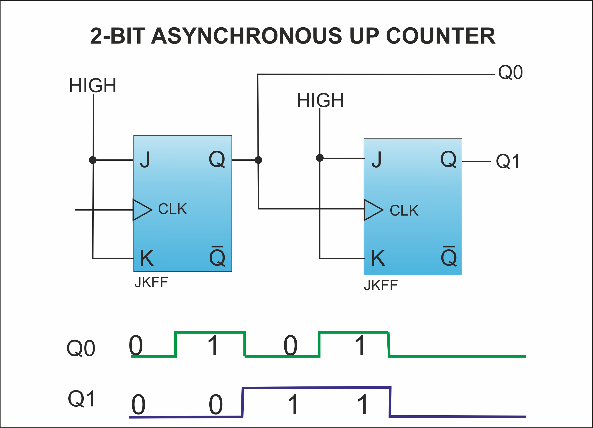
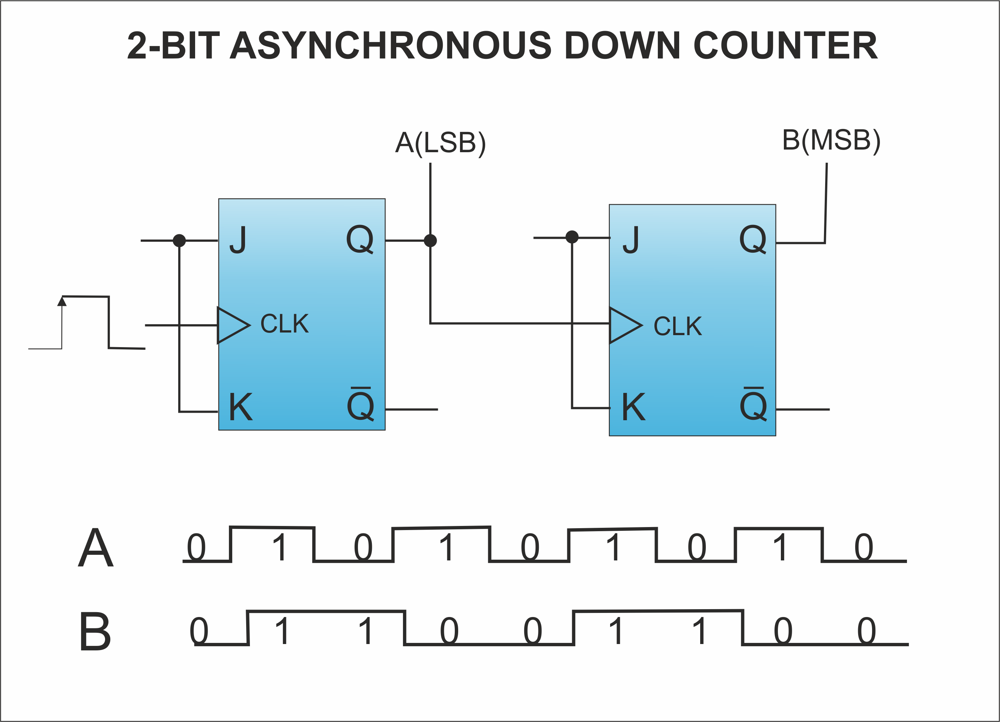
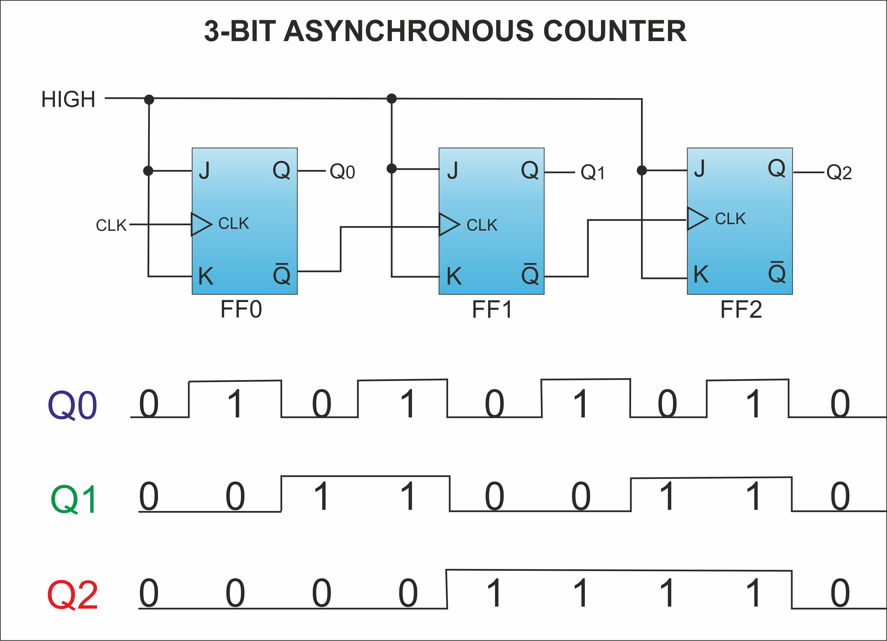
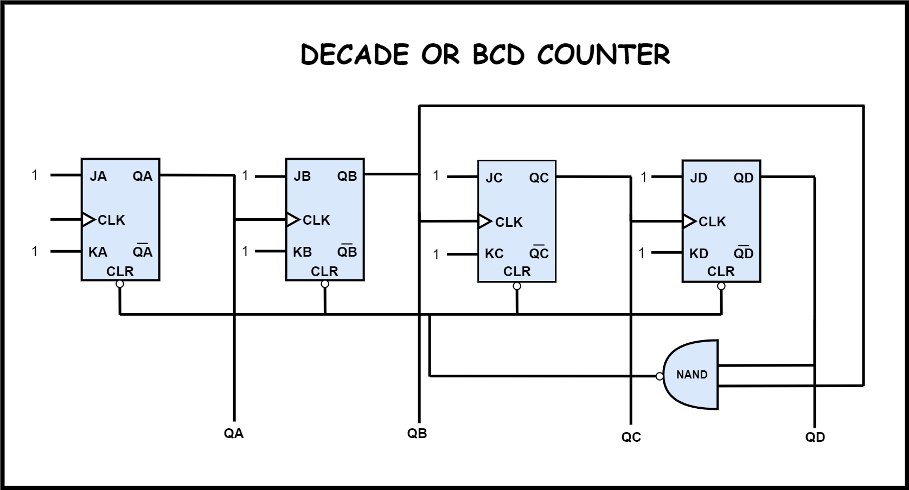
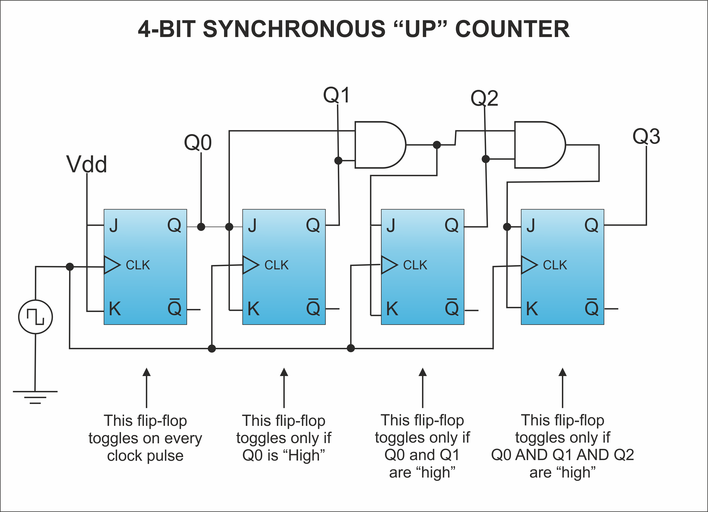
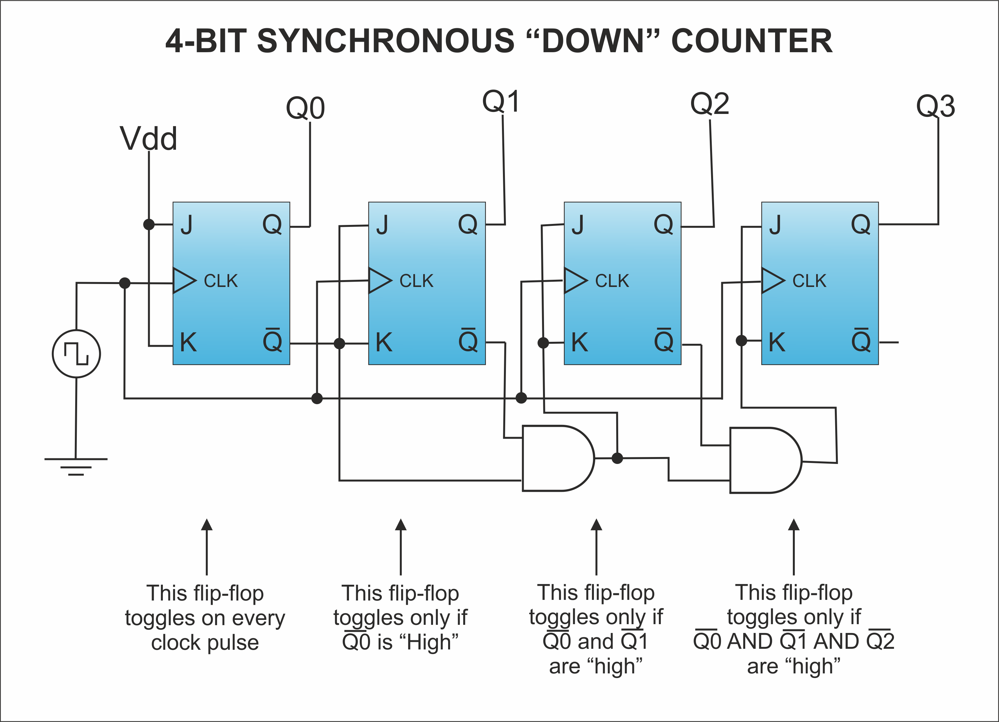
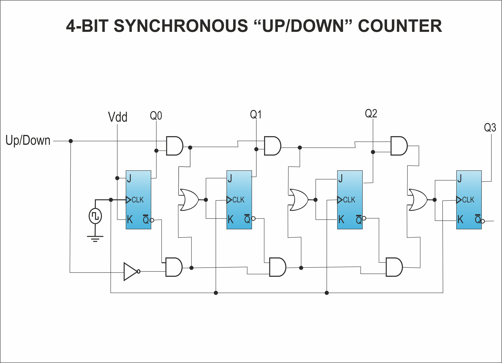
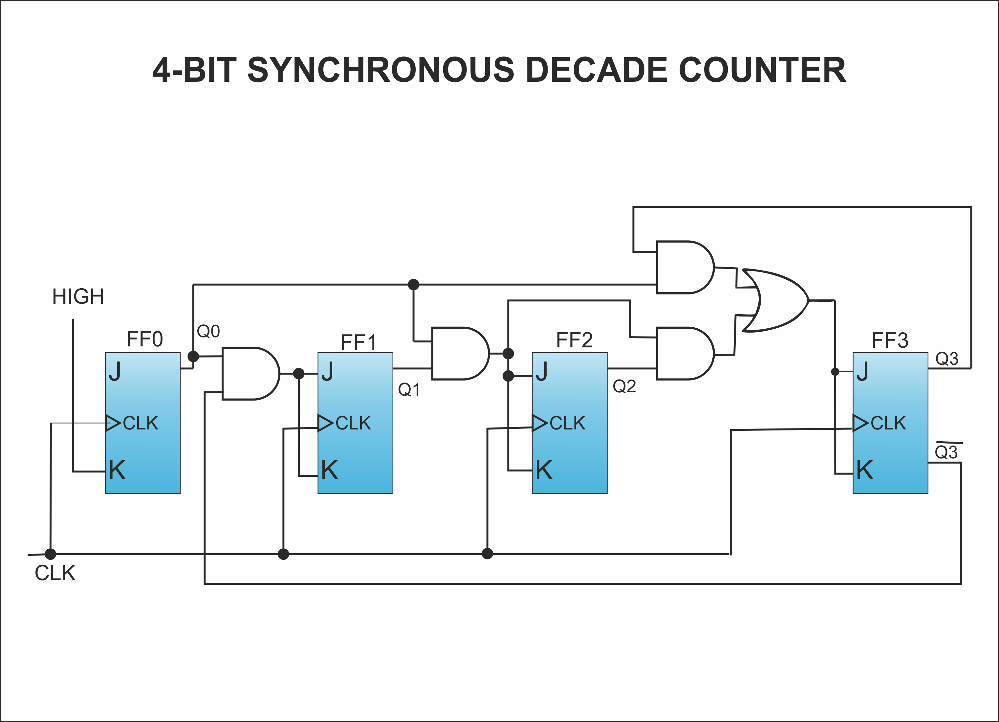
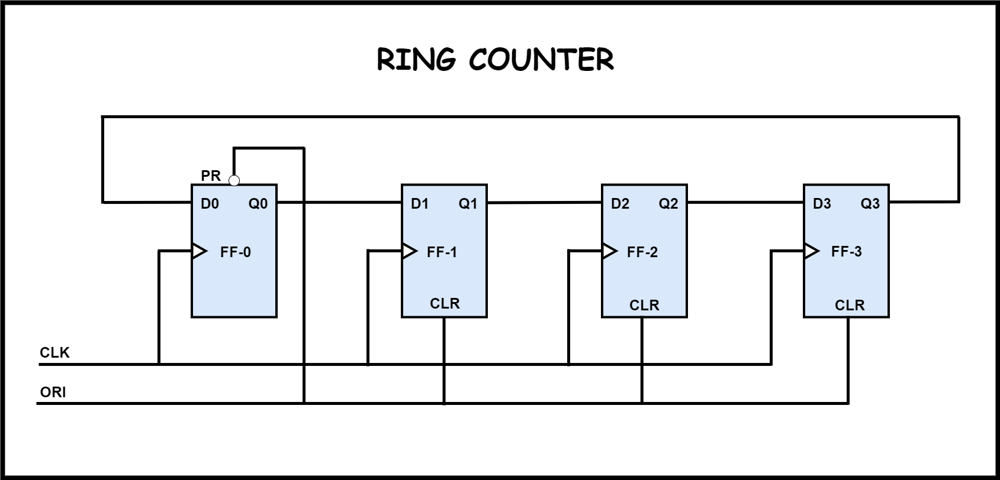

# Digital Counters
{: .no_toc }

The Counter is a sequential circuit which is used to count.  
Counters are of two types.

## Table of contents
{: .no_toc .text-delta }

1. TOC
{:toc}

---

## Asynchronous or ripple counters

In Asynchronous counters flip-flops doesn't have a common clock pulse.So their states doesn't change at the same time.
Here toggle (T) flip-flops are being used. 
But we can also use the JK flip-flop also with J and K connected permanently to logic 1. 
External clock is applied to the clock input of first flip-flop, i.e FF-A and output of FF-A, i.e QA is applied to the clock input of the next flip-flop i.e. FF-B.
The logic diagram of a 2-bit ripple up counter is shown in figure. 

### Logical Diagram

### Types 
It is known as ripple counter because of the way the clock pulse ripples its way through the flip-flops. The flip-flop applied with external clock pulse act as LSB (Least Significant Bit) in the counting sequence.The flip-flop toggles the output either for every positive edge of clock signal or for negative edge of clock signal.
* **2 bit ripple up counter:** It contains two flip flops. A 2-bit ripple counter can count up to 4 states. It counts from 0 to 3.

 

* **2 bit ripple down counter:** It contains two flip flops. A 2-bit ripple counter can count up to 4 states. It is known as down counter as it counts down from 3 to 0.

* **3 bit ripple up counter:** It contains three flip flops. A 3-bit ripple counter can count up to 8 states. It counts from 0 to 7.

* **3 bit ripple down counter:** It contains three flip flops. A 3-bit ripple counter can count up to 8 states.It counts down from 7 to 0.

* **Decade or BCD counter :**  A binary coded decimal (BCD) is a serial digital counter that counts ten digits. It counts from 0 to 9.When the clock pulse advances to 10 the ports QB and QD become high and thus NAND gate's output will become low which will reset all the flip flops.

### Operation

|Condition|Operation|
|:--------|:--------|
|**Initially let both the FFs be in the reset state**|QBQA = 00 initially.|
|**After 1st negative clock edge**|As soon as the first negative clock edge is applied, FF-A will toggle and QA will be equal to 1.QA is connected to clock input of FF-B. Since QA has changed from 0 to 1, it is treated as the positive clock edge by FF-B. There is no change in QB because FF-B is a negative edge triggered FF.QBQA = 01 after the first clock pulse.|
|**After 2nd negative clock edge**|On the arrival of second negative clock edge, FF-A toggles again and QA = 0.The change in QA acts as a negative clock edge for FF-B. So it will also toggle, and QB will be 1.QBQA = 10 after the second clock pulse.|
|**After 3rd negative clock edge**|On the arrival of 3rd negative clock edge, FF-A toggles again and QA become 1 from 0.Since this is a positive going change, FF-B does not respond to it and remains inactive. So QB does not change and continues to be equal to 1.QBQA = 11 after the third clock pulse.|
|**After 4th negative clock edge**|On the arrival of 4th negative clock edge, FF-A toggles again and QA becomes 1 from 0.This negative change in QA acts as clock pulse for FF-B. Hence it toggles to change QB from 1 to 0.QBQA = 00 after the fourth clock pulse.
                                                                                                                                                                                                       
### Truth Table 

## Synchronous counters

If the "clock" pulses are applied to all the flip-flops in a counter simultaneously, then such a counter is called as synchronous counter.
The logic diagram of a Synchronous counter is shown in figure. 

### Logical Diagram

### 2-bit Synchronous up counter

The JA and KA inputs of FF-A are tied to logic 1. So FF-A will work as a toggle flip-flop. The JB and KB inputs are connected to QA.

### Types 
* **4 bit synchronous up counter:** In the up counter the 4 bit binary sequence starts from 0000 and increments up to 1111, i.e from 0 to 15.

 

* **4 bit synchronous down counter:** Down counter counts the numbers in decreasing order i.e from 15 to 0.

 

* **4 bit synchronous up/down counter:** This counter has two modes of counting i.e. up counting and down counting. There is a mode switch which switches between the two modes of the counter. When the mode M = 0 it counts up & when mode M = 1 then it counts down.

 

* **4-Bit Synchronous Decade Counter:** A BCD decade counter exhibits a truncated binary sequence and goes from 0000 through the
1001 state. Rather than going from the 1001 state to the 1010 state, it recycles to the 0000 state. 

 

* **Ring Counter:** The ring counter is a application of shift register, in which the output of last flip flop is connected to input of first flip flop. In ring counter if the output of any flip flop is 1, then the output of remaining flip flops is 0. The Ring counters transfers the same output throughout the circuit.

 

* **Johnson's Counter or Twisted Ring Counter:** The Johnson counter is ring counter in which clear input is used for the first flip flop instead of preset input. In this the complemented output of the last flip flop is given as the input to first flip flop. If we use n flip flops to design the Johnson counter, then the no.of states is equal to 2n.

 

### Operation

|Condition|Operation|
|:--------|:-------:|
|**Initially let both the FFs be in the reset state**|QBQA = 00 initially.|
|**After 1st negative clock edge**|As soon as the first negative clock edge is applied, FF-A will toggle and QA will change from 0 to 1.But at the instant of application of negative clock edge, QA , JB = KB = 0. Hence FF-B will not change its state. So QB will remain 0.QBQA = 01 after the first clock pulse.|
|**After 2nd negative clock edge**|On the arrival of second negative clock edge, FF-A toggles again and QA changes from 1 to 0.But at this instant QA was 1. So JB = KB= 1 and FF-B will toggle. Hence QB changes from 0 to 1.QBQA = 10 after the second clock pulse.|
|**After 3rd negative clock edge**|On application of the third falling clock edge, FF-A will toggle from 0 to 1 but there is no change of state for FF-B.QBQA = 11 after the third clock pulse.|
|**After 4th negative clock edge**|On application of the next clock pulse, QA will change from 1 to 0 as QB will also change from 1 to 0.QBQA = 00 after the fourth clock pulse.|


