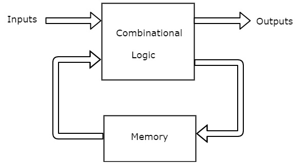
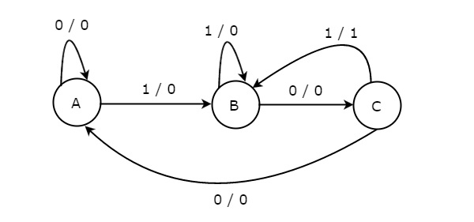
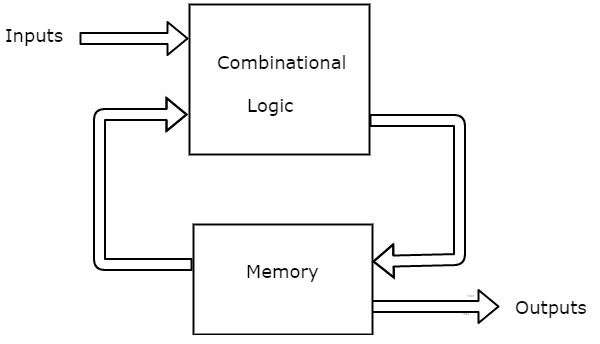
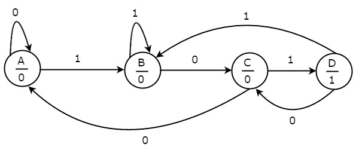
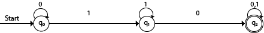
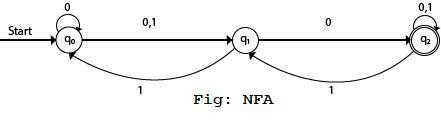

## Table of contents
{: .no_toc .text-delta }

1. TOC
{:toc}

---

## Introduction
We know that synchronous sequential circuits change (affect) their states for every positive (or negative) transition of the clock signal based on the input. 
So, this behavior of synchronous sequential circuits can be represented in the graphical form and it is known as **state diagram**.
A synchronous sequential circuit is also called as **Finite State Machine** (FSM), if it has finite number of states. Depending on the type of output, it can be categorised into following types:

* FSM with output
  1. Mealy State Machine
  2. Moore State Machine
* FSM without output
   1. Deterministic Finite Automata
   2. Non-Deterministic Automata
   3. Epsilon-Non Deterministic Automata

Now, let us discuss about these state machines one by one.
# FSM with output
## Mealy State Machine
A Finite State Machine is said to be Mealy state machine, if outputs depend on both present inputs & present states. 
The **block diagram** of Mealy state machine is shown in the following figure.

As shown in figure, there are two parts present in Mealy state machine. 
Those are combinational logic and memory. Memory is useful to provide some or part of previous outputs **(present states)** as inputs of combinational logic.

So, based on the present inputs and present states, the Mealy state machine produces outputs. 
Therefore, the outputs will be valid only at positive (or negative) transition of the clock signal.

The **state diagram** of Mealy state machine is shown in the following figure.

In the above figure, there are three states, namely A, B & C. 
These states are labelled inside the circles & each circle corresponds to one state. 
Transitions between these states are represented with directed lines. Here, 0 / 0, 1 / 0 & 1 / 1 denotes **input / output**. 
In the above figure, there are two transitions from each state based on the value of input, x.

In general, the number of states required in Mealy state machine is less than or equal to the number of states required in Moore state machine. 
There is an equivalent Moore state machine for each Mealy state machine.

## Moore State Machine
A Finite State Machine is said to be Moore state machine, if outputs depend only on present states. The block diagram of Moore state machine is shown in the following figure.

As shown in figure, there are two parts present in Moore state machine. Those are combinational logic and memory. In this case, the present inputs and present states determine the next states. So, based on next states, Moore state machine produces the outputs. Therefore, the outputs will be valid only after transition of the state.

The state diagram of Moore state machine is shown in the following figure.

In the above figure, there are four states, namely A, B, C & D. These states and the respective outputs are labelled inside the circles. Here, only the input value is labeled on each transition. In the above figure, there are two transitions from each state based on the value of input, x.

In general, the number of states required in Moore state machine is more than or equal to the number of states required in Mealy state machine. There is an equivalent Mealy state machine for each Moore state machine. So, based on the requirement we can use one of them.



# FSM without output
# Deterministic Finite Automata
Unlike Mealy and Moore machine, this type of FSM doesn't have memory and combinational logic. Deterministic refers to the uniqueness of the computation. The finite automata are called deterministic finite automata if the machine is read an input string one symbol at a time.
There is only one path for specific input from the current state to the next state. 
It does not accept the null move, i.e., the DFA cannot change state without any input character.
It can contain multiple final states. 

A DFA can be represented by digraphs called state diagram. In which:

1. The state is represented by vertices.
2. The arc labeled with an input character show the transitions.
3. The initial state is marked with an arrow.
4. The final state is denoted by a double circle.

A DFA is a collection of 5-tuples:
Q: finite set of states  
∑: finite set of the input symbol  
q0: initial state   
F: final state  
δ: Transition function

**Example**

Q = {q0, q1, q2}  
∑ = {0, 1}  
q0 = {q0}  
F = {q2}  

**Transition Diagram:**

**Transition Table:**

| Present State | Next state for Input 0 | Next State of Input 1 |
| ------------- | -----------------------| --------------------- | 
| →q0            |q0                      | q1|
| q1 | q2 | q1|
| q2 | q2 | q2|

**Explanation:** In the above diagram, we can see that on given 1 as input to DFA in state q0 the DFA changes state to q1 and 
always go to itself on starting input 0. Similiarly, q1 goes to final state q2 on getting 0 as input and self-loops when input is 1. 
It can't accept any string which starts with 0, because it will never go to final state. Therefore, valid set of strings are 10, 100,1000..... and 101,1011,101111.... etc.

# Non Deterministic Finite Automata
NFA stands for non-deterministic finite automata. It is easy to construct an NFA than DFA for a given regular language.
The finite automata are called NFA when there exist many paths for specific input from the current state to the next state.
Every NFA is not DFA, but each NFA can be translated into DFA.
NFA is defined in the same way as DFA but with the following two exceptions, it contains multiple next states, and it contains ε transition.

NFA also has five states same as DFA, but with different transition function, as shown follows:

δ: Q x ∑ →2Q

where,

Q: finite set of states  
∑: finite set of the input symbol  
q0: initial state   
F: final state  
δ: Transition function 

**Example:**
Q = {q0, q1, q2}  
∑ = {0, 1}  
q0 = {q0}  
F = {q2}  

Transition Diagram:

**Transition Table:**

| Present State | Next state for Input 0 | Next State of Input 1 |
| ------------- | -----------------------| --------------------- | 
| →q0           |q0, q1                  | q1|
| q1 | q2 | q0|
| q2 | q2 | q1, q2|

**Explanation:**

In the above diagram, we can see that when the current state is q0, on input 0, the next state will be q0 or q1, and on 1 input the next state will be q1. When the current state is q1, on input 0 the next state will be q2 and on 1 input, the next state will be q0. When the current state is q2, on 0 input the next state is q2, and on 1 input the next state will be q1 or q2.

# Epsilon NFA

We extend the class of NFAs by allowing
instantaneous (ε) transitions:
1. The automaton may be allowed to change its
state without reading the input symbol.
2. In diagrams, such transitions are depicted by
labeling the appropriate arcs with ε.
3. Note that this does not mean that ε has become
an input symbol. On the contrary, we assume
that the symbol ε does not belong to any
alphabet. 

