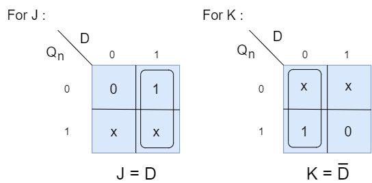
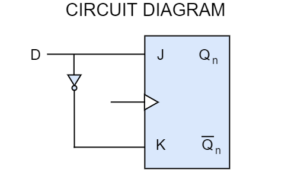
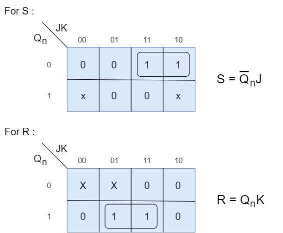
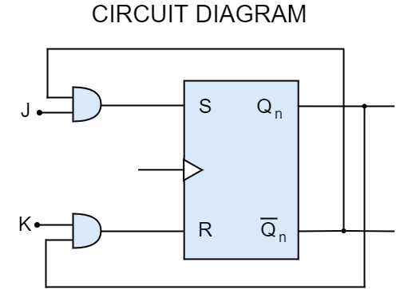
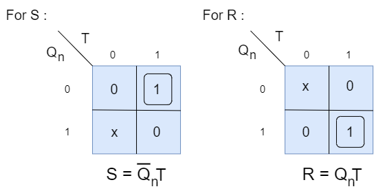
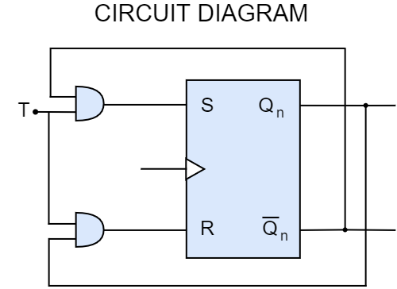
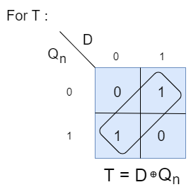
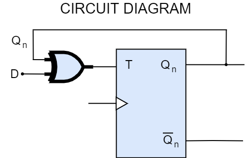

# flip-flop Conversions
{: .no_toc }

This page will teach you how to convert one type of Flip flop to another type.

<h2>Steps to be followed :</h2>
 <ul>
   <li> Identify available and required Flip flop. </li>
   <li> Make characteristic table for required Flip flop. </li>
   <li> Make excitation table for available Flip flop. </li>
   <li> Write boolean expression for available Flip flop. </li>
   <li> Draw the circuit. </li>
 </ul>

## Table of contents
{: .no_toc .text-delta }

1. TOC
{:toc}

---

## JK flip-flop to D flip-flop

We can convert JK Flip-Flop to D Flip-Flop by following the above mentioned steps.

<h3>Step 1</h3>
 
<li>Available Flip-Flop = JK Flip-Flop</li>
<li>Required Flip-Flop = D Flip-Flop</li>

<h3>Step 2</h3>

| Qn | D | Q(n+1) |
|:--:|:-:|:------:|
| 0 | 0 | 0 |
| 0 | 1 | 1 |
| 1 | 0 | 0 |
| 1 | 1 | 1 |

<h3>Step 3</h3>

| Qn | D | Q(n+1) | J | K | 
|:--:|:-:|:------:|:-:|:-:|
| 0 | 0 | 0 | 0 | X |
| 0 | 1 | 1 | 1 | X |
| 1 | 0 | 0 | X | 1 |
| 1 | 1 | 1 | X | 0 |

<h3>Step 4</h3>

Here we are finding the boolean expression by using K-Map.

<h3>Step 5</h3>

## SR flip-flop to JK flip-flop

We can convert SR Flip-Flop to JK Flip-Flop by following the above mentioned steps.

<h3>Step 1</h3>
 
<li>Available Flip-Flop = SR Flip-Flop</li>
<li>Required Flip-Flop = JK Flip-Flop</li>

<h3>Step 2</h3>

| Qn | J | K | Q(n+1) |
|:--:|:-:|:-:|:------:|
| 0 | 0 | 0 | 0 | 
| 0 | 0 | 1 | 0 | 
| 0 | 1 | 0 | 1 | 
| 0 | 1 | 1 | 1 | 
| 1 | 0 | 0 | 1 | 
| 1 | 0 | 1 | 0 | 
| 1 | 1 | 0 | 1 | 
| 1 | 1 | 1 | 0 | 

<h3>Step 3</h3>

| Qn | J | K | Q(n+1) | S | R |
|:--:|:-:|:-:|:------:|:-:|:-:|
| 0 | 0 | 0 | 0 | 0 | X | 
| 0 | 0 | 1 | 0 | 0 | X | 
| 0 | 1 | 0 | 1 | 1 | 0 |  
| 0 | 1 | 1 | 1 | 1 | 0 | 
| 1 | 0 | 0 | 1 | X | 0 | 
| 1 | 0 | 1 | 0 | 0 | 1 | 
| 1 | 1 | 0 | 1 | X | 0 |
| 1 | 1 | 1 | 0 | 0 | 1 |

<h3>Step 4</h3>

Here we are finding the boolean expression by using K-Map.

<h3>Step 5</h3>

## SR flip-flop to T flip-flop

We can convert SR Flip-Flop to T Flip-Flop by following the above mentioned steps.

<h3>Step 1</h3>
 
<li>Available Flip-Flop = SR Flip-Flop</li>
<li>Required Flip-Flop = T Flip-Flop</li>

<h3>Step 2</h3>

| Qn | T | Q(n+1) |
|:--:|:-:|:------:|
| 0 | 0 | 0 |
| 0 | 1 | 1 |
| 1 | 0 | 1 |
| 1 | 1 | 0 |

<h3>Step 3</h3>

| Qn | T | Q(n+1) | S | R |
|:--:|:-:|:------:|:-:|:-:|
| 0 | 0 | 0 | 0 | X |
| 0 | 1 | 1 | 1 | 0 |
| 1 | 0 | 1 | X | 0 |
| 1 | 1 | 0 | 0 | 1 |

<h3>Step 4</h3>

Here we are finding the boolean expression by using K-Map.

<h3>Step 5</h3>

## T flip-flop to D flip-flop

We can convert SR Flip-Flop to T Flip-Flop by following the above mentioned steps.

<h3>Step 1</h3>
 
<li>Available Flip-Flop = T Flip-Flop</li>
<li>Required Flip-Flop = D Flip-Flop</li>

<h3>Step 2</h3>

| Qn | D | Q(n+1) |
|:--:|:-:|:------:|
| 0 | 0 | 0 |
| 0 | 1 | 1 |
| 1 | 0 | 0 |
| 1 | 1 | 1 |

<h3>Step 3</h3>

| Qn | D | Q(n+1) | T |
|:--:|:-:|:------:|:-:|
| 0 | 0 | 0 | 0 |
| 0 | 1 | 1 | 1 |
| 1 | 0 | 0 | 1 |
| 1 | 1 | 1 | 0 |

<h3>Step 4</h3>

Here we are finding the boolean expression by using K-Map.

<h3>Step 5</h3>


