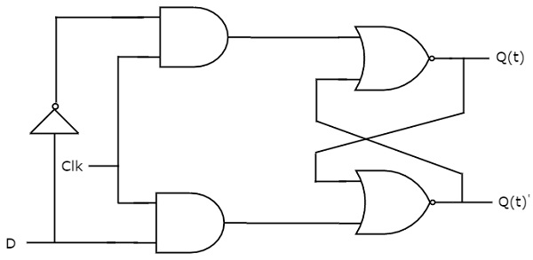

# D flip-flop
{: .no_toc}

## Table of contents
{: .no_toc .text-delta }

1. TOC
{:toc}

## Introduction

D flip-flop operates with only positive clock transitions or negative clock transitions. Whereas, D latch operates with enable signal. That means, the output of D flip-flop is insensitive to the changes in the input, D except for active transition of the clock signal. The circuit diagram of D flip-flop is shown in the following figure.

<div style="text-align:center"></div>

This circuit has single input D and two outputs Q(t) & Q(t)’. The operation of D flip-flop is similar to D Latch. But, this flip-flop affects the outputs only when positive transition of the clock signal is applied instead of active enable.


## State table

| D    |    Q(t+1) | 
|:-------|:--------|
|  0     |    0    | 
|  1     |    1    |


Therefore, D flip-flop always Hold the information, which is available on data input, D of earlier positive transition of clock signal. From the above state table, the next state equation can be directly written as
```yaml
        Q(t + 1) = D
```
Next state of D flip-flop is always equal to data input, D for every positive transition of the clock signal. Hence, D flip-flops can be used in registers, shift registers and some of the counters.

<iframe width="100%" height="400px" src="https://circuitverse.org/simulator/embed/12254" id="d_flipflop_01" scrolling="no" webkitAllowFullScreen mozAllowFullScreen allowFullScreen> </iframe>
