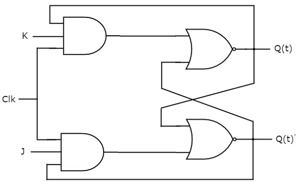
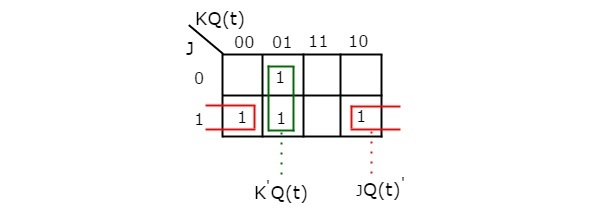

# JK flip-flop
{: .no_toc}

## Table of contents
{: .no_toc .text-delta }

1. TOC
{:toc}

## Introduction

JK flip-flop is the modified version of SR flip-flop. It operates with only positive clock transitions or negative clock transitions. The circuit diagram of JK flip-flop is shown in the following figure.

<div style="text-align:center"></div>

This circuit has two inputs J & K and two outputs Q(t) & Q(t)’. The operation of JK flip-flop is similar to SR flip-flop. Here, the inputs of SR flip-flop are considered as **S = J Q(t)’** and **R = KQ(t)** in order to utilize the modified SR flip-flop for 4 combinations of inputs.

## State table 

| J      |    K    |   Q(t+1) |
|:-------|:--------|:---------|
|  0     |    0    |  Q(t)    |
|  0     |    1    |    0     |
|  1     |    0    |    1     |
|  1     |    1    |  Q(t)’   |

Here, Q(t) & Q(t + 1) are present state & next state respectively. So, JK flip-flop can be used for one of these four functions such as Hold, Reset, Set & Complement of present state based on the input conditions, when positive transition of clock signal is applied.

## Characteristic table 


| J      |    K    |   Q(t) |   Q(t+1) |
|:-------|:--------|:-------|:---------|
|0	|0	|0	|0|
|0	|0	|1	|1|
|0	|1	|0	|0|
|0	|1	|1	|0|
|1	|0	|0	|1|
|1	|0	|1	|1|
|1	|1	|0	|1|
|1	|1	|1	|0|

By using three variable K-Map, you can get the simplified expression for next state, Q(t + 1). The **three variable K-Map** for next state, Q(t + 1) is shown in the following figure.

<div style="text-align:center"></div>

The maximum possible groupings of adjacent ones are already shown in the figure. Therefore, the simplified expression for next state Q(t+1) is
```yaml
          Q(t + 1) = J.Q(t)' + K'.Q(t)
```

<iframe width="100%" height="400px" src="https://circuitverse.org/simulator/embed/12263" id="jk_flipflop_01" scrolling="no" webkitAllowFullScreen mozAllowFullScreen allowFullScreen> </iframe>