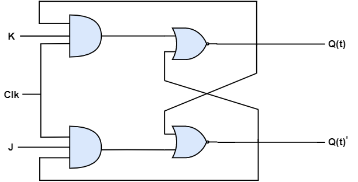

## JK Flip-Flop

JK flip-flop is the modified version of SR flip-flop. JK flip-flop has a advantage over SR flip-flop. It operates only when the clock has a positive or negative transition. The circuit diagram of JK flip-flop is shown below.

<div style="text-align:center"></div>

This circuit has two inputs J & K and two outputs Q(t) & Q(t)’. The operation of JK flip-flop is similar to that of SR flip-flop. Here, we consider the inputs of SR flip-flop as **S = J Q(t)’** and **R = KQ(t)** in order to use the modified SR flip-flop for 4 combinations of inputs.
### State table of **SR** flip-flop.

| J      |    K    |   Q(t+1) |
|:-------|:--------|:---------|
|  0     |    0    |  Q(t)    |
|  0     |    1    |    0     |
|  1     |    0    |    1     |
|  1     |    1    |  Q(t)’   |

Here, Q(t) & Q(t + 1) are the present state & next state respectively. So, JK flip-flop can be utilised for one of these four functions such as Hold, Reset, Set & Complement of the present state based on the input conditions, when positive transition of clock signal is applied.

### Characteristic table of SR flip-flop.


| J      |    K    |   Q(t) |   Q(t+1) |
|:-------|:--------|:-------|:---------|
|0	|0	|0	|0|
|0	|0	|1	|1|
|0	|1	|0	|0|
|0	|1	|1	|0|
|1	|0	|0	|1|
|1	|0	|1	|1|
|1	|1	|0	|1|
|1	|1	|1	|0|

By using 3 variable K-Map, we can get the simplified expression for next state, Q(t + 1). The **three variable K-Map** for next state, Q(t + 1) is shown below.

<div style="text-align:center"></div>

The maximum possible groupings of near by ones are already shown in the figure. Therefore, the simplified expression for next state Q(t+1) is
```yaml
          Q(t+1)=JQ(t)′+K′Q(t)
```

<iframe width="100%" height="400px" src="https://circuitverse.org/simulator/embed/12263" id="projectPreview" scrolling="no" webkitAllowFullScreen mozAllowFullScreen allowFullScreen> </iframe>
