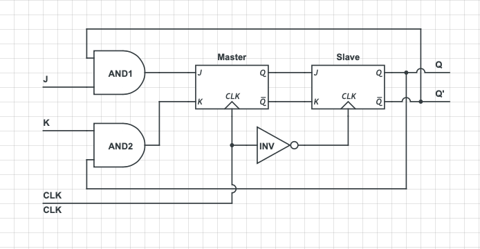

## JK Master Slave Flip-Flop

JK master slave flip flop are two JK flip flops joined together in a series configuration. One flip flop is considered as “master” and it triggers on the leading edge of the clock pulse. The other slave flip flop triggers on the falling  edge of the clock pulse.

<div style="text-align:center"></div>

This circuit has two inputs J & K and two outputs Q(t) & Q(t)’. The operation of JK master slave flip-flop is similar to JK flip-flop. 
### State table of **SR** flip-flop.

| J      |    K    |        CLK        |   Q(t+1) |    Inference   |
|:-------|:--------|:------------------|:---------|:---------------|
|  0     |    0    |  Positive Pulse   |  Q(t)    |     Hold       |
|  0     |    1    |  Positive Pulse   |    0     |     Reset      |
|  1     |    0    |  Positive Pulse   |    1     |     Set        |
|  1     |    1    |  Positive Pulse   |  Q(t)’   |     Toggle     |

Here, Q(t) & Q(t + 1) are present state & next state respectively. So, JK flip-flop can be used for one of these four functions such as Hold, Reset, Set & Complement of present state based on the input conditions, when positive pulse of clock signal is applied.

### Characteristic table of JK master slave flip-flop.


| J      |    K    |   Q(t) |   Q(t+1) |
|:-------|:--------|:-------|:---------|
|0	|0	|0	|0|
|0	|0	|1	|1|
|0	|1	|0	|0|
|0	|1	|1	|0|
|1	|0	|0	|1|
|1	|0	|1	|1|
|1	|1	|0	|1|
|1	|1	|1	|0|

From the above characteristic table, we can directly write the next state equation as:
```yaml
          Q(t+1)=J*Q’(t)+K’*Q(t) 
```

<iframe width="100%" height="400px" src="https://circuitverse.org/simulator/embed/47534" id="projectPreview" scrolling="no" webkitAllowFullScreen mozAllowFullScreen allowFullScreen> </iframe>
