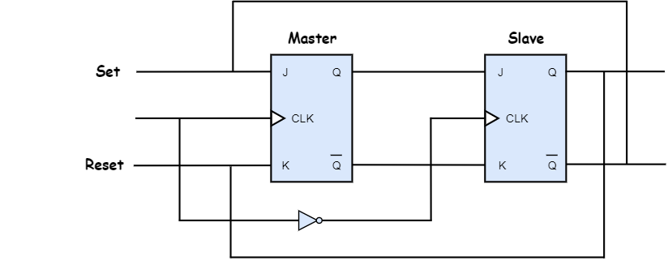
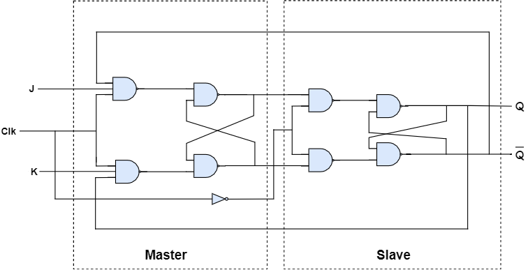

## Master Slave JK Flip-Flop

Master Slave JK Flip-flop is designed to eliminate the race around condition in JK flip-flop and it is constructed by using two JK flip-flops as shown in the circuit diagram below.

<div style="text-align:center"></div>

The first flip-flop is called the _master_, and it is driven by the positive clock cycle.
The second flip-flop is called the _slave_, and it is driven by the negative clock cycle.
During the positive clock cycle, master flip-flop gives the intermediate output but slave flip-flop will not give the final output.
During the negative clock cycle, slave flip-flop gets activated and copies the previous output of the master flip-flop and produces the final output.

### Master Slave JK Flip-flop constructed by using NAND gates

<div style="text-align:center"></div>

### State table

| Clock | J | K | Q(n+1) | Comments |
|:---:|:-:|:-:|:------:|:----------:|
| 0 | X | X | Q(n)  | No change |
| 1 | 0 | 0 | Q(n)  | No change |
| 1 | 0 | 1 | 0     | Reset     |
| 1 | 1 | 0 | 1     | Set       |
| 1 | 1 | 1 | Q(n)' | Toggle    |

Here, Q(n) is the present state and Q(n+1) is the next state.

### Characteristic table

| Q(n) | J | K | Q(n+1) |
|:---:|:-:|:-:|:------:|
| 0 | 0 | 0 | 0 |
| 0 | 0 | 1 | 0 |
| 0 | 1 | 0 | 1 |
| 0 | 1 | 1 | 1 |
| 1 | 0 | 0 | 1 |
| 1 | 0 | 1 | 0 |
| 1 | 1 | 0 | 1 |
| 1 | 1 | 1 | 0 |


### Excitation table

| Q(n) | Q(n+1) | J | K |
|:---:|:-:|:-:|:------:|
| 0 | 0 | 0 | X |
| 0 | 1 | 1 | X |
| 1 | 0 | X | 1 |
| 1 | 1 | X | 0 |


### Characteristic Equation

````
Q(n+1) = Q(n)'J + Q(n)K'
````
<iframe width="100%" height="400px" src="https://circuitverse.org/simulator/embed/47630" id="projectPreview" scrolling="no" webkitAllowFullScreen mozAllowFullScreen allowFullScreen> </iframe>
