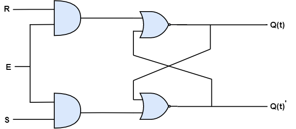

## SR Flip-Flop

SR flip-flop operates only when the clock has a positive or negative clock transitions. Though, SR latch operates with enable signal. The circuit diagram of SR flip-flop is shown below.

<div style="text-align:center"></div>

This circuit has two inputs S & R and two outputs Q(t) & Q(t)’. The operation of SR flipflop is similar to that of SR Latch. But, this flip-flop has influence on the outputs only when positive transition of the clock signal is applied instead of active enable.

### State table of **SR** flip-flop.

| S      |    R    |   Q(t+1) |
|:-------|:--------|:---------|
|  0     |    0    |  Q(t)    |
|  0     |    1    |    0     |
|  1     |    0    |    1     |
|  1     |    1    |    -     |

Here, Q(t) & Q(t + 1) are the present state & next state respectively. So, JK flip-flop can be utilised for one of these four functions such as Hold, Reset, Set & Complement of the present state based on the input conditions, when positive transition of clock signal is applied.

### Characteristic table of SR flip-flop.

Therefore, SR Latch performs three types of functions such as Hold, Set & Reset based on the input conditions.

| S      |    R    |   Q(t) |   Q(t+1) |
|:-------|:--------|:-------|:---------|
|0	|0	|0	|0|
|0	|0	|1	|1|
|0	|1	|0	|0|
|0	|1	|1	|0|
|1	|0	|0	|1|
|1	|0	|1	|1|
|1	|1	|0	|x|
|1	|1	|1	|x|

By using 3 variable K-Map, we can get the simplified expression for next state, Q(t + 1). The three variable K-Map for next state, Q(t + 1) is shown below.

<div style="text-align:center"></div>

The maximum possible groupings of near by ones are already shown in the figure. Therefore, the simplified expression for next state Q(t+1) is
```yaml
          Q(t+1)=S+R′Q(t)
```

<iframe width="100%" height="400px" src="https://circuitverse.org/simulator/embed/12264" id="projectPreview" scrolling="no" webkitAllowFullScreen mozAllowFullScreen allowFullScreen> </iframe>
