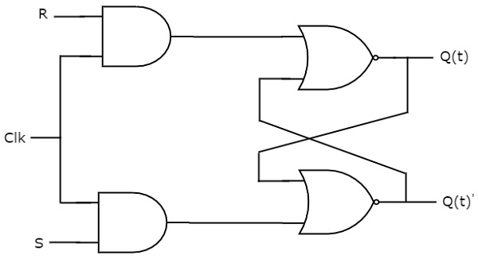
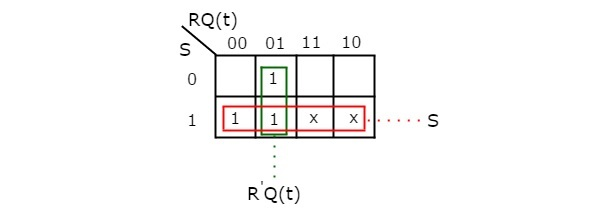

# SR flip-flop
{: .no_toc}

## Table of contents
{: .no_toc .text-delta }

1. TOC
{:toc}

## Introduction

SR flip-flop operates with only positive clock transitions or negative clock transitions. Whereas, SR latch operates with enable signal. The circuit diagram of SR flip-flop is shown in the following figure.

<div style="text-align:center"></div>

his circuit has two inputs S & R and two outputs Q(t) & Q(t)’. The operation of SR flipflop is similar to SR Latch. But, this flip-flop affects the outputs only when positive transition of the clock signal is applied instead of active enable.

## State table 

| S      |    R    |   Q(t+1) |
|:-------|:--------|:---------|
|  0     |    0    |  Q(t)    |
|  0     |    1    |    0     |
|  1     |    0    |    1     |
|  1     |    1    |    -     |

Here, Q(t) & Q(t + 1) are present state & next state respectively. So, SR flip-flop can be used for one of these three functions such as Hold, Reset & Set based on the input conditions, when positive transition of clock signal is applied. 

## Characteristic table 

Therefore, SR Latch performs three types of functions such as Hold, Set & Reset based on the input conditions.

| S      |    R    |   Q(t) |   Q(t+1) |
|:-------|:--------|:-------|:---------|
|0	|0	|0	|0|
|0	|0	|1	|1|
|0	|1	|0	|0|
|0	|1	|1	|0|
|1	|0	|0	|1|
|1	|0	|1	|1|
|1	|1	|0	|x|
|1	|1	|1	|x|

By using three **variable K-Map**, you can get the simplified expression for next state, Q(t + 1). The three variable K-Map for next state, Q(t + 1) is shown in the following figure.

<div style="text-align:center"></div>

The maximum possible groupings of adjacent ones are already shown in the figure. Therefore, the simplified expression for next state Q(t + 1) is
```yaml
          Q(t + 1) = S + R'.Q(t)
```

<iframe width="100%" height="400px" src="https://circuitverse.org/simulator/embed/12264" id="sr_flipflop_01" scrolling="no" webkitAllowFullScreen mozAllowFullScreen allowFullScreen> </iframe>
