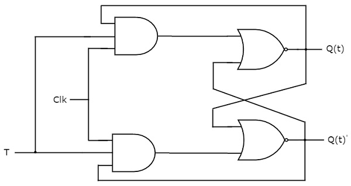

# T flip-flop
{: .no_toc}

## Table of contents
{: .no_toc .text-delta }

1. TOC
{:toc}

## Introduction

T flip-flop is the simplified version of JK flip-flop. It is obtained by connecting the same input ‘T’ to both inputs of JK flip-flop. It operates with only positive clock transitions or negative clock transitions. The circuit diagram of T flip-flop is shown in the following figure.

<div style="text-align:center"></div>

This circuit has single input T and two outputs Q(t) & Q(t)’. The operation of T flip-flop is same as that of JK flip-flop. Here, the inputs of JK flip-flop are considered as J = T and K = T in order to utilize the modified JK flip-flop for 2 combinations of inputs. So, the other two combinations of J & K are eliminated, for which those two values are complement to each other in T flip-flop.

## State table 


| D    |    Q(t+1) | 
|:-------|:--------|
|  0     |    Q(t)    | 
|  1     |    Q(t)'    |

Here, Q(t) & Q(t + 1) are present state & next state respectively. So, T flip-flop can be used for one of these two functions such as Hold, & Complement of present state based on the input conditions, when positive transition of clock signal is applied. 


## Characteristic table


|T	     |Q(t)	   |Q(t + 1)|
|:-------|:--------|:-------|
|0	|0	|0|
|0	|1	|1|
|1	|0	|1|
|1	|1	|0|

From the above characteristic table, the next state equation can be directly written as:


```yaml
          Q(t + 1) = T'.Q(t) + T.Q(t)'
          => Q(t + 1) = T ⊕ Q(t)
```

The output of T flip-flop always toggles for every positive transition of the clock signal, when input T remains at logic High (1). Hence, T flip-flop can be used in counters.


<iframe width="100%" height="400px" src="https://circuitverse.org/simulator/embed/12258" id="t_flipflop_01" scrolling="no" webkitAllowFullScreen mozAllowFullScreen allowFullScreen> </iframe>
