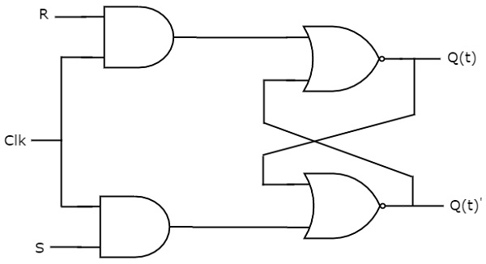

# Flip-Flops
{: .no_toc }

In previous module, we discussed about Latches. Those are the basic building blocks of flip-flops. We can implement flip-flops in two methods.

In first method, cascade two latches in such a way that the first latch is enabled for every positive clock pulse and second latch is enabled for every negative clock pulse. So that the combination of these two latches become a flip-flop.

In second method, we can directly implement the flip-flop, which is edge sensitive. In this chapter, let us discuss the following flip-flops using second method.

* **SR** Flip-Flop
* **D** Flip-Flop
* **JK** Flip-Flop
* **T** Flip-Flop

## Table of contents
{: .no_toc .text-delta }

1. TOC
{:toc}

---

## SR Flip-Flop

SR flip-flop operates with only positive clock transitions or negative clock transitions. Whereas, SR latch operates with enable signal. The circuit diagram of SR flip-flop is shown in the following figure.

his circuit has two inputs S & R and two outputs Q(t) & Q(t)’. The operation of SR flipflop is similar to SR Latch. But, this flip-flop affects the outputs only when positive transition of the clock signal is applied instead of active enable.

### state table of **SR** flip-flop.

| S      |    R    |   Q(t+1) |
|:-------|:--------|:---------|
|  0     |    0    |  Q(t)    |
|  0     |    1    |    0     |
|  1     |    0    |    1     |
|  1     |    1    |    -     |

Here, Q(t) & Q(t + 1) are present state & next state respectively. So, SR flip-flop can be used for one of these three functions such as Hold, Reset & Set based on the input conditions, when positive transition of clock signal is applied. 

### Characteristic table of SR flip-flop.

Therefore, SR Latch performs three types of functions such as Hold, Set & Reset based on the input conditions.

