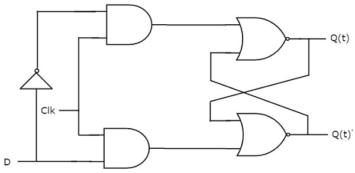
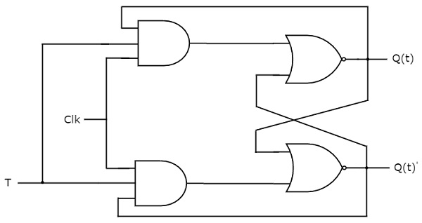

# Flip-Flops
{: .no_toc }

In previous module, we discussed about Latches. Those are the basic building blocks of flip-flops. We can implement flip-flops in two methods.

In first method, cascade two latches in such a way that the first latch is enabled for every positive clock pulse and second latch is enabled for every negative clock pulse. So that the combination of these two latches become a flip-flop.

In second module, we can directly implement the flip-flop, which is edge sensitive. In this module, let us discuss the following flip-flops using second method.

* **SR** Flip-Flop
* **D** Flip-Flop
* **JK** Flip-Flop
* **T** Flip-Flop


## Table of contents
{: .no_toc .text-delta }

1. TOC
{:toc}

---


## SR Flip-Flop

SR flip-flop operates with only positive clock transitions or negative clock transitions. Whereas, SR latch operates with enable signal. The circuit diagram of SR flip-flop is shown in the following figure.

<div style="text-align:center"></div>

his circuit has two inputs S & R and two outputs Q(t) & Q(t)’. The operation of SR flipflop is similar to SR Latch. But, this flip-flop affects the outputs only when positive transition of the clock signal is applied instead of active enable.

### State table of **SR** flip-flop.

| S      |    R    |   Q(t+1) |
|:-------|:--------|:---------|
|  0     |    0    |  Q(t)    |
|  0     |    1    |    0     |
|  1     |    0    |    1     |
|  1     |    1    |    -     |

Here, Q(t) & Q(t + 1) are present state & next state respectively. So, SR flip-flop can be used for one of these three functions such as Hold, Reset & Set based on the input conditions, when positive transition of clock signal is applied. 

### Characteristic table of SR flip-flop.

Therefore, SR Latch performs three types of functions such as Hold, Set & Reset based on the input conditions.

| S      |    R    |   Q(t) |   Q(t+1) |
|:-------|:--------|:-------|:---------|
|0	|0	|0	|0|
|0	|0	|1	|1|
|0	|1	|0	|0|
|0	|1	|1	|0|
|1	|0	|0	|1|
|1	|0	|1	|1|
|1	|1	|0	|x|
|1	|1	|1	|x|

By using three **variable K-Map**, we can get the simplified expression for next state, Q(t + 1). The three variable K-Map for next state, Q(t + 1) is shown in the following figure.

<div style="text-align:center"></div>

The maximum possible groupings of adjacent ones are already shown in the figure. Therefore, the simplified expression for next state Q(t + 1) is
```yaml
          Q(t+1)=S+R′Q(t)
```


## D Flip-Flop

D flip-flop operates with only positive clock transitions or negative clock transitions. Whereas, D latch operates with enable signal. That means, the output of D flip-flop is insensitive to the changes in the input, D except for active transition of the clock signal. The circuit diagram of D flip-flop is shown in the following figure.

<div style="text-align:center"></div>

This circuit has single input D and two outputs Q(t) & Q(t)’. The operation of D flip-flop is similar to D Latch. But, this flip-flop affects the outputs only when positive transition of the clock signal is applied instead of active enable.


### State table of **D** flip-flop.

| D    |    Q(t+1) | 
|:-------|:--------|
|  0     |    0    | 
|  1     |    1    |


Therefore, D flip-flop always Hold the information, which is available on data input, D of earlier positive transition of clock signal. From the above state table, we can directly write the next state equation as
```yaml
        Q(t + 1) = D
```
Next state of D flip-flop is always equal to data input, D for every positive transition of the clock signal. Hence, D flip-flops can be used in registers, shift registers and some of the counters.

## JK Flip-Flop

JK flip-flop is the modified version of SR flip-flop. It operates with only positive clock transitions or negative clock transitions. The circuit diagram of JK flip-flop is shown in the following figure.

<div style="text-align:center"></div>

This circuit has two inputs J & K and two outputs Q(t) & Q(t)’. The operation of JK flip-flop is similar to SR flip-flop. Here, we considered the inputs of SR flip-flop as **S = J Q(t)’** and **R = KQ(t)** in order to utilize the modified SR flip-flop for 4 combinations of inputs.
### State table of **SR** flip-flop.

| J      |    K    |   Q(t+1) |
|:-------|:--------|:---------|
|  0     |    0    |  Q(t)    |
|  0     |    1    |    0     |
|  1     |    0    |    1     |
|  1     |    1    |  Q(t)’   |

Here, Q(t) & Q(t + 1) are present state & next state respectively. So, JK flip-flop can be used for one of these four functions such as Hold, Reset, Set & Complement of present state based on the input conditions, when positive transition of clock signal is applied.

### Characteristic table of SR flip-flop.


| J      |    K    |   Q(t) |   Q(t+1) |
|:-------|:--------|:-------|:---------|
|0	|0	|0	|0|
|0	|0	|1	|1|
|0	|1	|0	|0|
|0	|1	|1	|0|
|1	|0	|0	|1|
|1	|0	|1	|1|
|1	|1	|0	|1|
|1	|1	|1	|0|

By using three variable K-Map, we can get the simplified expression for next state, Q(t + 1). The **three variable K-Map** for next state, Q(t + 1) is shown in the following figure.

<div style="text-align:center"></div>

The maximum possible groupings of adjacent ones are already shown in the figure. Therefore, the simplified expression for next state Q(t+1) is
```yaml
          Q(t+1)=JQ(t)′+K′Q(t)
```

## T Flip-Flop

T flip-flop is the simplified version of JK flip-flop. It is obtained by connecting the same input ‘T’ to both inputs of JK flip-flop. It operates with only positive clock transitions or negative clock transitions. The circuit diagram of T flip-flop is shown in the following figure.

<div style="text-align:center"></div>

This circuit has single input T and two outputs Q(t) & Q(t)’. The operation of T flip-flop is same as that of JK flip-flop. Here, we considered the inputs of JK flip-flop as J = T and K = T in order to utilize the modified JK flip-flop for 2 combinations of inputs. So, we eliminated the other two combinations of J & K, for which those two values are complement to each other in T flip-flop.

### State table of **T** flip-flop.


| D    |    Q(t+1) | 
|:-------|:--------|
|  0     |    Q(t)    | 
|  1     |    Q(t)'    |

Here, Q(t) & Q(t + 1) are present state & next state respectively. So, T flip-flop can be used for one of these two functions such as Hold, & Complement of present state based on the input conditions, when positive transition of clock signal is applied. 


### Characteristic table of T flip-flop.


|T	     |Q(t)	   |Q(t + 1)|
|:-------|:--------|:-------|
|0	|0	|0|
|0	|1	|1|
|1	|0	|1|
|1	|1	|0|

From the above characteristic table, we can directly write the next state equation as


```yaml
          Q(t+1)=T′Q(t)+TQ(t)′
           
          ⇒  Q(t+1)=T⊕Q(t)
```

The output of T flip-flop always toggles for every positive transition of the clock signal, when input T remains at logic High (1). Hence, T flip-flop can be used in counters.

## Conclusion

In this chapter, we implemented various flip-flops by providing the cross coupling between NOR gates. Similarly, you can implement these flip-flops by using NAND gates.


