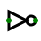
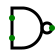
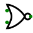
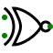

# Logic Gates
{: .no_toc }


## Table of contents
{: .no_toc .text-delta }

1. TOC
{:toc}

---


## Introduction


Logic Gates are devices which perform logical operations on one or more inputs and produces a single output.
Logic gates can be categorized into 3 groups:
1. Basic Gates: NOT, AND, OR
2. Universal Gates: NAND, NOR
3. Arithmetic Gates: X-OR, X-NOR

<h2>Truth Table</h2>

The Table which contains all logical possibilities is known as truth table.

## NOT gate

The NOT gate is also known as an inverter because it produces the exact opposite of the input as output. It has one input and one output. The Truth table for NOT gate is given below

| Input        | Output       | 
|:------------:|:------------:|
| 0            | 1            | 
| 1            | 0            | 



<iframe width="100%" height="220px" src="https://circuitverse.org/simulator/embed/46600" id="projectPreview" scrolling="no" webkitAllowFullScreen mozAllowFullScreen allowFullScreen> </iframe>


```Verilog
 module not_gate(
    input a,
    output c );
assign c=~a;
endmodule
```

## AND gate

The AND gate's operation is similar to that of multiplication. It has two inputs and one output. The output is high (1) if both inputs are 1, and for all other cases, the output is low (0).
The Truth table for AND gate which consists of two inputs is given below

| Input 1      | Input 2      | Output |
|:------------:|:------------:|:------:|
| 0            | 0            | 0      |
| 0            | 1            | 0      |
| 1            | 0            | 0      |
| 1            | 1            | 1      |


<iframe width="100%" height="220px" src="https://circuitverse.org/simulator/embed/46601" id="projectPreview" scrolling="no" webkitAllowFullScreen mozAllowFullScreen allowFullScreen> </iframe>

```Verilog
 module and_gate(
    input a,
    input b,
    output c );
assign c=a&b;
endmodule
```

## OR gate

The OR gate has two inputs and one output. If at least one of the inputs is 1, then the output will be high (1). If neither of the inputs is 1, then the output will be low (0).
The Truth table of OR gate which consists of two inputs is given below

| Input 1       | Input 2      | Output |
|:-------------:|:------------:|:------:|
| 0             | 0            | 0      |
| 0             | 1            | 1      |
| 1             | 0            | 1      |
| 1             | 1            | 1      |


<iframe width="100%" height="220px" src="https://circuitverse.org/simulator/embed/46603" id="projectPreview" scrolling="no" webkitAllowFullScreen mozAllowFullScreen allowFullScreen> </iframe>


```Verilog
 module or_gate(
    input a,
    input b,
    output c );
assign c=a | b;
endmodule
```

## NAND gate

The NAND gate is the complement of the AND gate. You can think of it as an AND gate followed immediately by a NOT gate. Its output is low (0) when both the inputs are 1, and for all other cases, its output is high (1). The symbol of NAND gate consists of AND gate followed by a small circle.
The Truth table of NAND gate which consists of two inputs is given below

| Input 1       | Input 2      | Output |
|:-------------:|:------------:|:------:|
| 0             | 0            | 1      |
| 0             | 1            | 1      |
| 1             | 0            | 1      |
| 1             | 1            | 0      |



<iframe width="100%" height="220px" src="https://circuitverse.org/simulator/embed/46604" id="projectPreview" scrolling="no" webkitAllowFullScreen mozAllowFullScreen allowFullScreen> </iframe>

```Verilog
 module nand_gate(
    input a,
    input b,
    output c );
assign c=~(a&b);
endmodule
```


## NOR gate

The NOR gate is the complement of the OR gate. You can think of it as an OR gate followed immediately by a NOT gate. Its output is low (0) when one or both of the inputs are 1, and for all other cases, its output is high (1). The symbol of NOR gate consists of OR gate followed by a small circle.
The Truth table of NOR gate which consists of two inputs is given below

| Input 1       | Input 2      | Output |
|:-------------:|:------------:|:------:|
| 0             | 0            | 1      |
| 0             | 1            | 0      |
| 1             | 0            | 0      |
| 1             | 1            | 0      |



<iframe width="100%" height="220px" src="https://circuitverse.org/simulator/embed/46606" id="projectPreview" scrolling="no" webkitAllowFullScreen mozAllowFullScreen allowFullScreen> </iframe>

```Verilog
 module nor_gate(
    input a,
    input b,
    output c );
assign c=~(a | b);
endmodule
```

## XOR gate

The XOR (or) Exclusive-OR is a digital Logic gate that gives the output as high (1) if and only if one of the input is 1.
The Truth table of XOR gate which consists of two inputs is given below

| Input 1       | Input 2      | Output |
|:-------------:|:------------:|:------:|
| 0             | 0            | 0      |
| 0             | 1            | 1      |
| 1             | 0            | 1      |
| 1             | 1            | 0      |


<iframe width="100%" height="220px" src="https://circuitverse.org/simulator/embed/46609" id="projectPreview" scrolling="no" webkitAllowFullScreen mozAllowFullScreen allowFullScreen> </iframe>

```Verilog
 module xor_gate(
    input a,
    input b,
    output c );
assign c=a ^ b;
endmodule
```

## XNOR gate

The XNOR (or) Exclusive-NOR is a digital Logic gate that gives the output as high (1) when both the inputs are same.
The Truth table of XNOR gate which consists of two inputs is given below

| Input 1       | Input 2      | Output |
|:-------------:|:------------:|:------:|
| 0             | 0            | 1      |
| 0             | 1            | 0      |
| 1             | 0            | 0      |
| 1             | 1            | 1      |



<iframe width="100%" height="220px" src="https://circuitverse.org/simulator/embed/46613" id="projectPreview" scrolling="no" webkitAllowFullScreen mozAllowFullScreen allowFullScreen> </iframe>

```Verilog
 module xnor_gate(
    input a,
    input b,
    output c );
assign c=~(a ^ b);
endmodule
```
