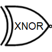

# Logic Gates
{: .no_toc }

## Table of contents
{: .no_toc .text-delta }

1. TOC
{:toc}

---

## Introduction

Logic gates are the basic building blocks of any digital system. 
It is an electronic circuit having one or more than one input and only one output. The relationship between the input and the output is based on a certain logic. Based on this, logic gates are named as AND gate, OR gate, NOT gate etc.

## NOT gate

The NOT gate is also known as an inverter because the output is the exact opposite of the input. It has one input and one output. The two possibilities are written out in the table below. Tables listing all logical possibilities like this are known as truth tables.

| Input1       | Input 2      |
|:------------:|:------------:|
| 0            | 1            | 
| 1            | 0            | 

## AND gate

The AND gate has two inputs and one output. The output is 1 if both inputs are 1, and for all other cases the output is 0.

| Input1       | Input 2      | output |
|:------------:|:------------:|:------:|
| 0            | 0            | 0      |
| 0            | 1            | 0      |
| 1            | 0            | 0      |
| 1            | 1            | 1      |

## OR gate

The OR gate has two inputs and one output. If at least one of the inputs is 1, then the output will be 1. If neither input is 1, the output will be 0.

| Input1       | Input 2      | output |
|:------------:|:------------:|:------:|
| 0            | 0            | 0      |
| 0            | 1            | 1      |
| 1            | 0            | 1      |
| 1            | 1            | 1      |

## NAND gate

The NAND gate behaves in the opposite fashion to and AND gate. You can think of it as an AND gate followed immediately by a NOT gate. Its output is 0 when the two inputs are 1, and for all other cases, its output is 0. The name NAND comes from joining NOT and AND. The symbol for NAND is the same as that for AND except for the addition of a small circle on the right side.

| Input1       | Input 2      | output |
|:------------:|:------------:|:------:|
| 0            | 0            | 1      |
| 0            | 1            | 1      |
| 1            | 0            | 1      |
| 1            | 1            | 0      |

## NOR gate

The NAND gate behaves in the opposite fashion to and AND gate. You can think of it as an AND gate followed immediately by a NOT gate. Its output is 0 when the two inputs are 1, and for all other cases, its output is 0. The name NAND comes from joining NOT and AND. The symbol for NAND is the same as that for AND except for the addition of a small circle on the right side.

| Input1       | Input 2      | output |
|:------------:|:------------:|:------:|
| 0            | 0            | 1      |
| 0            | 1            | 0      |
| 1            | 0            | 0      |
| 1            | 1            | 0      |

## XOR gate

The NAND gate behaves in the opposite fashion to and AND gate. You can think of it as an AND gate followed immediately by a NOT gate. Its output is 0 when the two inputs are 1, and for all other cases, its output is 0. The name NAND comes from joining NOT and AND. The symbol for NAND is the same as that for AND except for the addition of a small circle on the right side.

| Input1       | Input 2      | output |
|:------------:|:------------:|:------:|
| 0            | 0            | 0      |
| 0            | 1            | 1      |
| 1            | 0            | 1      |
| 1            | 1            | 0      |

You can also click/tap a symbol to copy it and then click/tap to paste it into the box. 

<h2>Two-Way Light Switch</h2>

In your house you probabably have a light with more than one switch - e.g. landing lights often have switches upstairs and downstairs.  Add the correct logic gate to the circuit and see if you can get this light work to work in the same way.  You can click on <em>Upstairs</em> and <em>Downstairs</em> switches to change them.

  
Upstairs

Downstairs

 

<input id="R2" onChange="show_result_2(2);" type="hidden">

<h2 style="clear: left">Security Light</h2>

You can buy security lights that come on only when it's dark and they sense some movement. Add the correct logic gate to the circuit and see if you can get it to work (you can click on <em>Darkness</em> and <em>Movement</em> to change them).

Darkness

Movement

 

<input id="R1" onChange="show_result_2(1);" type="hidden">

