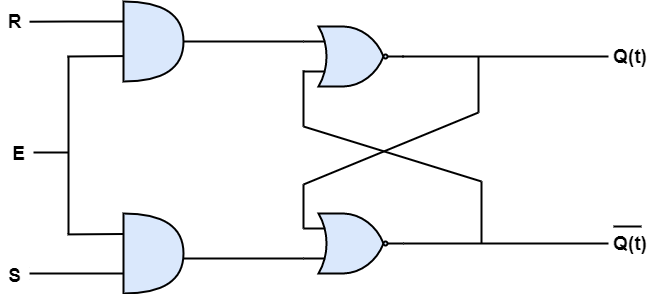
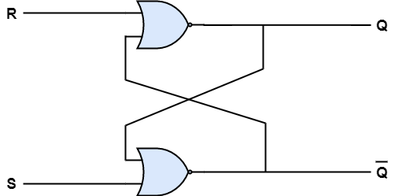
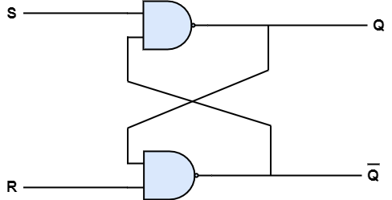
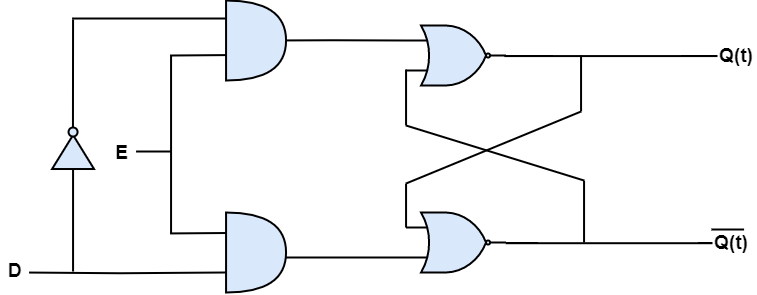

# Latches
{: .no_toc }

There are two types of memory elements based on the type of triggering that is suitable to operate it.

* Latches
* Flip-flops

A Latch is a basic storage element which is used to store one binary digit .
In this module, let us discuss about SR Latch & D Latch.

## Table of contents
{: .no_toc .text-delta }

1. TOC
{:toc}

---

## SR Latch

In SR Latch, S stands for Set and R stands for Reset so it is also called as Set Reset Latch. 

This circuit has two inputs S & R and two outputs Q(t) & Q(t)’. The **upper NOR gate** has two inputs R & complement of present state Q(t)'.
Similarly, the **lower NOR gate** has two inputs S & present state, Q(t).

* If S = 1, then next state Q(t + 1) will be equal to ‘1’ irrespective of present state, Q(t) values.

* If R = 1, then next state Q(t + 1) will be equal to ‘0’ irrespective of present state, Q(t) values.

When both the inputs are ‘1’, then the next state Q(t + 1) value is undefined.

The truth table of SR Latch is given below.

| S      |    R    |   Q(t+1) |
|:------:|:-------:|:--------:|
|  0     |    0    |  Q(t)    |
|  0     |    1    |    0     |
|  1     |    0    |    1     |
|  1     |    1    |    -     |

<iframe width="100%" height="400px" src="https://circuitverse.org/simulator/embed/46875" id="projectPreview" scrolling="no" webkitAllowFullScreen mozAllowFullScreen allowFullScreen> </iframe>

 **Drawback:** Next state value can’t be predicted when both the inputs (S & R) are one. 

There are two types of SR Latch 
* NOR-SR Latch
* NAND-SR Latch

<h3> NOR-SR Latch </h3>

Here, SR Latch is constructed by using NOR Gates.
The circuit diagram of NOR-SR Latch is shown in the following figure.

This circuit has two inputs S & R and two outputs Q & Q’.

* If Set (S) = 1, then output (Q) will be equal to ‘1’.

* If Reset (R) = 0, then output (Q) will be equal to ‘0'.

**Case 1:**
When S=0 and R=1, output (Q)=0 and the next state (Q') will be equal to 1.
When S=0 and R=0, output (Q)=0 and the next state (Q') will be equal to 1. This condition is called as Memory because the output (or) stored data remains the same. 

**Case 2:**
When S=1 and R=0, output (Q)=1 and the next state (Q') will be equal to 0.
When S=0 and R=0, output (Q)=1 and the next state (Q') will be equal to 0. This condition is also called as Memory.

**Case 3:**
When S=1 and R=1, output (Q)=0 and the next state (Q') will be equal to 0.
This case is not used since Q cannot be equal to Q'.

The truth table of NOR-SR latch is given below.

| S      |    R    |   Q  | Q' |
|:------:|:-------:|:----:|:--:|
|  0     |    0    |    Same as before (memory)   |  Same as before (memory)  |
|  0     |    1    |     0     |    1    |
|  1     |    0    |     1     |    0    |
|  1     |    1    |     *     |    *    |

<iframe width="100%" height="400px" src="https://circuitverse.org/simulator/embed/46863" id="projectPreview" scrolling="no" webkitAllowFullScreen mozAllowFullScreen allowFullScreen> </iframe>

<h3> NAND-SR Latch </h3>

Here, SR Latch is constructed by using NAND Gates.
The circuit diagram of NAND-SR Latch is shown in the following figure.

This circuit has two inputs S & R and two outputs Q & Q’.

* If Set (S) = 1, then output (Q) will be equal to ‘1’.

* If Reset (R) = 0, then output (Q) will be equal to ‘0'.

**Case 1:**
When S=0 and R=1, output (Q)=1 and the next state (Q') will be equal to 0.
When S=1 and R=1, output (Q)=1 and the next state (Q') will be equal to 0. This condition is called as Memory because the output (or) stored data remains the same. 

**Case 2:**
When S=1 and R=0, output (Q)=0 and the next state (Q') will be equal to 1.
When S=1 and R=1, output (Q)=0 and the next state (Q') will be equal to 1. This condition is also called as Memory.

**Case 3:**
When S=1 and R=1, output (Q)=1 and the next state (Q') will be equal to 1.
This case is not used since Q cannot be equal to Q'.

The truth table of NAND-SR latch is given below.

| S      |    R    |   Q  | Q' |
|:------:|:-------:|:----:|:--:|
|  0     |    0    |     *     |    *    |
|  0     |    1    |     1     |    0    |
|  1     |    0    |     0     |    1    |
|  1     |    1    |    Same as before (memory)   |  Same as before (memory) |

<iframe width="100%" height="400px" src="https://circuitverse.org/simulator/embed/46865" id="projectPreview" scrolling="no" webkitAllowFullScreen mozAllowFullScreen allowFullScreen> </iframe>

## D Latch

D Latch is used to overcome the drawbacks of SR Latch.
It is also called as Data or Delay Latch. The circuit diagram of D Latch is shown in the following figure.

Here D Latch is obtained by placing an NOT gate in between S & R.
This circuit has single input D and two outputs Q & Q’. D Latch is obtained from SR Latch by placing an inverter between S amp;& R inputs and connect D input to S. That means we eliminated the combinations of S & R are of same value.

* If D = 0 → S = 0 & R = 1, then next state Q(t + 1) will be equal to ‘0’ irrespective of present state, Q(t) values. This is corresponding to the second row of SR Latch state table.

* If D = 1 → S = 1 & R = 0, then next state Q(t + 1) will be equal to ‘1’ irrespective of present state, Q(t) values. This is corresponding to the third row of SR Latch state table.

The following table shows the state table of D latch.

| D      | Q(t + 1) |
|:------:|:-----:|
| 0      | 0     |
| 1      | 1     |

From the truth table, we can clearly see that D Latch holds data input as the information. That means, D Latch is sensitive to the changes of data input.

In this module, we have implemented various Latches by providing the cross coupling between NOR gates gates. Similarly, you can implement these Latches using NAND gates.

<iframe width="100%" height="400px" src="https://circuitverse.org/simulator/embed/46876" id="projectPreview" scrolling="no" webkitAllowFullScreen mozAllowFullScreen allowFullScreen> </iframe>


