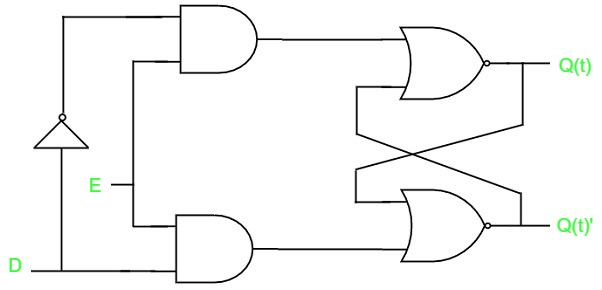

# Latches
{: .no_toc }

There are 2 types of memory elements, which is based on the type of triggering methods:

* Latches
* Flip-flops

Latches operate with an enable signal, which is level sensitive. 
Where as,the Flip-flops are edge sensitive. 
In the next module, lets discuss on Flip-flops.
Now, let us discuss on SR-Latch and D-Latch.

## Table of contents
{: .no_toc .text-delta }

1. TOC
{:toc}

---

## SR Latch

SR Latch(Set Reset Latch).The output is effected as long as the enable E is set to '1' .The circuit diagram of SR-Latch is given below.

The above circuit has 2 inputs 'S' & 'R' and the outputs Q(t) & Q(t)'. The **upper NOR-gate** has two inputs 'R' & complement of present state i.e. Q(t)' and produces next state i.e. Q(t+1) when the enable, E is '1'.
Similarly, the **lower NOR-gate** has 2 inputs 'S' & present state i.e. Q(t) and produces complement of the next state i.e. Q(t+1)' when the enable, E is ‘1’.

A 2-input NOR-gate produces an output, which is the inverse of another input, when one of the input is '0',and when one its input is equal to '1' it's output is equal to '0'.

* If 'S' is equal to '1', Then Q(t + 1) will be equal to '1' regardless of the present state, Q(t) values.

* If 'R' is equal to '1', Then Q(t + 1) will be equal to ‘0’ regardless of the present state, Q(t) values.

At any given time, only one of the two inputs should be ‘1’. If both inputs are ‘1’, then the next state i.e. Q(t + 1) value is undefined.

Truth table for **SR latch**:

| S      |    R    |   Q(t+1) |
|:------:|:-------:|:--------:|
|  0     |    0    |  Q(t)    |
|  0     |    1    |    0     |
|  1     |    0    |    1     |
|  1     |    1    |    -     |

Therefore, SR-Latch performs 3 types of functions i.e. Hold, Reset and Set based on the given input conditions.

<iframe width="100%" height="400px" src="https://circuitverse.org/simulator/embed/13774" id="projectPreview" scrolling="no" webkitAllowFullScreen mozAllowFullScreen allowFullScreen> </iframe>

## D Latch

There is only one drawback of SR-Latch. That is, the next state value cannot be predicted when the inputs 'S' & 'R' are one. So, We can overcome this problem by a D-Latch(Data-Latch). The circuit diagram for D-Latch is given below:

This circuit has a single input 'D', and 2 outputs Q(t) & Q(t)'. The D-Latch is obtained from SR-Latch, when an inverter is placed between R & S-amp inputs, and connect the 'D' input to 'S', which means that the  (S & R)'s combination is not of the same value.

* If (D = 0) => (S = 0) & (R = 1), then (Q(t + 1) = 0), regardless of the value of Q(t). This is similar to second row of the SR-Latch's state table.

* If (D = 1) => (S = 1) & (R = 0), then (Q(t + 1) = 1), regardless of the value of Q(t). This is similar to third row of the SR-Latch's state table.

The below table is the state table of D-Latch:

|    D    | Q(t + 1)|
|:-------:|:-------:|
|    0    |    0    |
|    1    |    1    |

Therefore, the D-Latch holds the information of the data input(D). Which means that the D-Latch's output depends on the change in input(D) till the enable ,E is equal to '1'.

In this module, we used a variety of Latches, by providing cross coupling between the NOR-gates. In a similar way, we can use these Latches with the help of NAND-gates.

<iframe width="100%" height="400px" src="https://circuitverse.org/simulator/embed/4276" id="projectPreview" scrolling="no" webkitAllowFullScreen mozAllowFullScreen allowFullScreen> </iframe>


