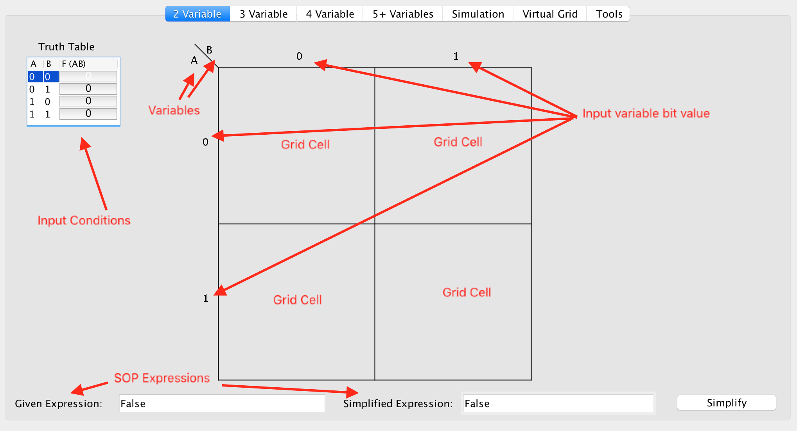
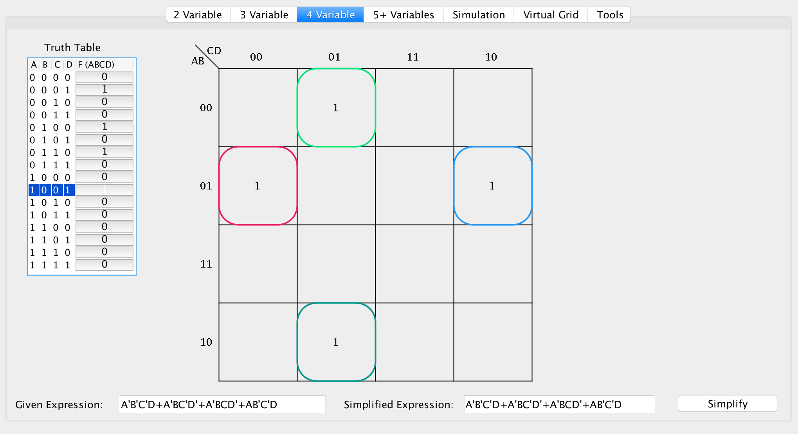
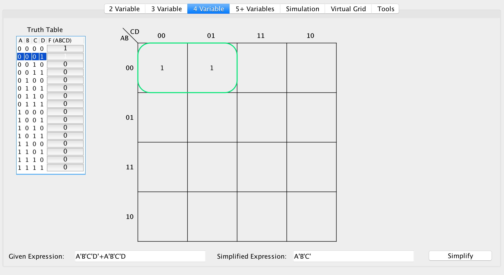
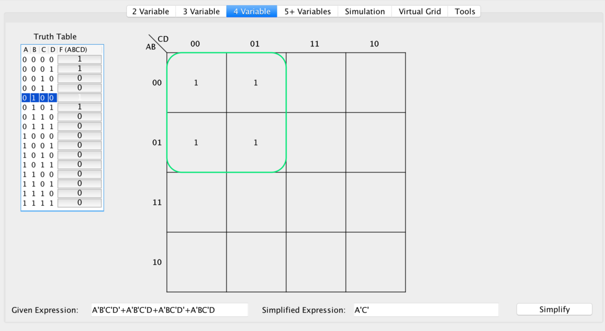
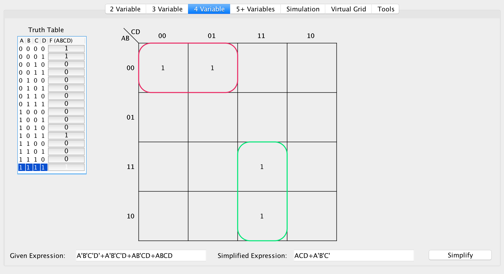
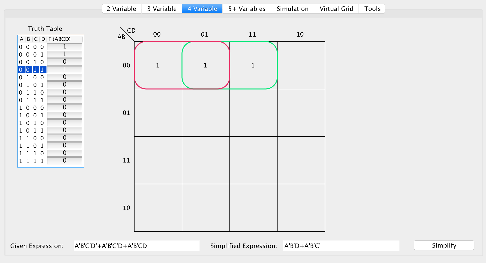
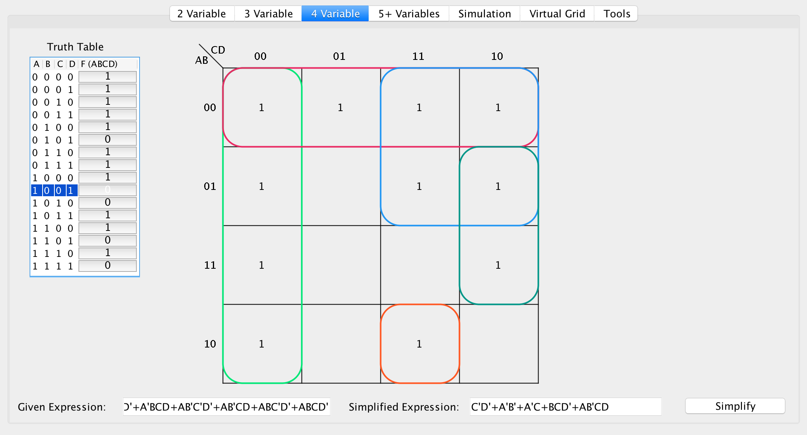
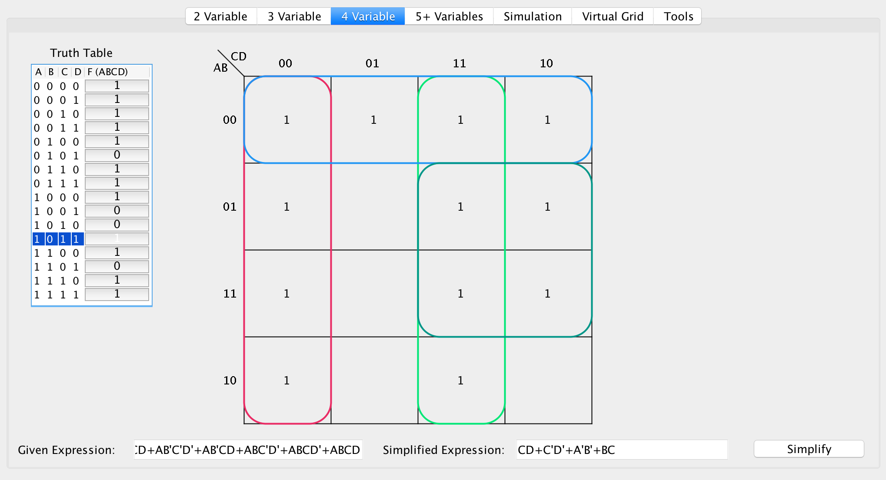

# K-Maps
{: .no_toc }


## Table of contents
{: .no_toc .text-delta }

1. TOC
{:toc}

---

## Introduction
A Karnaugh-Map(K-map) is helpful to display a boolean expression visually on a 2D grid. We bind the variables to an axis, then the variables which are bounded to an axis are enumerated through all the possible combinations of the input values.
Let's assume an example to display the 2 variable Karnaugh-Map:



Here, the vertical axis is bounded to the variable `A`, then `A` is enumerated through all its possible values, i.e., `{0, 1}`. In a similar way, the `B` variable is bounded to another axis(horizontal axis), and is enumerated through all its possible values. The visualization works properly in an `2x2` matrix.

Now, let's assume an more complex example of 4 variables:



 The vertical axis is bounded to `A` and `B` variables, while the horizontal axis is bounded to `C` and `D` variables. We can now enumarate through the different combinations of bounded variables for each of the axis in *Reflected Binary Code Order* (more on this in further sections). Finally, each true value is indicated on the matrix by augmenting a value of`1`.

## Enumeration and Gray Codes
When Enumerating through, the different variable input combinations, for the Binded axis, we take advantage of "_reflected binary code order_", otherwise known as Gray codes. When observed carefully, It is noticeable that, We only vary by one bit,from one combination to another, That is:

``` markdown
... 00 01 11 10 00 01 11 10 00 ...
    ^   ^ ^   ^ ^   ^ ^   ^ ^
```

Thus, We get this wrapping which allows us to, switch by only 1 bit. This provides the core for how Karnaugh-Maps work.

## Simple Groupings
The main idea behind,how the Karnaugh-Maps can be used to simplify the expressions, is to group pairs of `1`'s that are adjacent, & exploit the fact that, each 1 has only one bit difference from another. 



For this example, let us consider, `F(ABCD) = CELL`. We start with an expression of `F(0000) = 1` & `F(0001) = 1`. However, we can observe that irrespective of the value of last bit, We still get a `1`. Hence, let us take a look at the 'SOP' expressions:

```markdown
F(ABCD) = A'B'C'D' + A'B'C'D
F(0000) = 1
F(0001) = 1

Since the last bit is the same, we can ignore the D value, thus:
F(ABCD) = A'B'C'

We can confirm by simplifying algebraically:
F(ABCD) = A'B'C'D' + A'B'C'D
	    = A'B'C'(D' + D)
	    = A'B'C'
Therefore, the simplification is true.
```

This rule can be further extended to work for Rectangles & more!

## Two Dimension Groupings
The idea of isolating the changing bits which retain a consistent value, can be further eloborated, to generalize this to work for a higher dimension.The following example can be considered:



Letting `F(ABCD)= CELL`:
```markdown
F(0000) = 1
F(0001) = 1
F(0100) = 1
F(0101) = 1
```

Observe that, the bits dont change by 1 for all pairs of Numbers, for example `{ 0000 & 0101 }` differ by two bits. Although , We can take advantage, of the bit changed Horizontally or Vertically. It's irrelvant what that bit is. Take a look at the following example more concretely.

```markdown
0000 0001
0100 0101

=> A'B'C'D' + A'B'C'D + A'BC'D' + A'BC'D
Irrespective of the B variable, we still get true for all products in the SOP expression.
This is bounded vertically:
=> A'C'D' + A'C'D + A'C'D' + A'C'D
Irrespective of the D variable, we still get true for all products in the SOP expression.
This is bounded horizontally:
=> A'C' + A'C' + A'C' + A'C'
=> A'C' (1 + 1 + 1 + 1)
=> A'C' (1)
=> A'C'
```

Since, The difference in the bits needs to be generalized throughout a binding of the axis, We can have a binding of size (`2^n`) for a given axis. For Ex: `1x1, 1x2, 1x4, 2x2, 2x4, 4x4`. 

## Disjoint Groupings
Consider the following example:


The algorithm follows the same procedure as it did before, But, now the 2 groups are joined through 'SOP' expression. Giving `F(ABCD)=CELL`:
```markdown
F(0000) = 1
F(0001) = 1
F(1111) = 1
F(1011) = 1
```
This produces the following:
```markdown
A'B'C'D' + A'B'C'D + ABCD + AB'CD
Breaking down the expression:
(A'B'C'D' + A'B'C'D) + (ABCD + AB'CD)
=> (A'B'C'(D + D')) + (ACD(B + B'))
=> (A'B'C') + (ACD)
=> A'B'C' + ACD
```
Clearly, this is the same process we followed before, but iterated throughout all of the disjoint sets.

## Overlapping Groupings
Overlapping groupings becomes more complex, Because there exists ambigious cases, and sometimes what appears to be locally optimal solutuion may not be a globally optimal solution.

General technique for evaluating the overlapping of groups follows a Greedy-algorithm. Now define a unvisited cell which has a value of `1`. However it is presently not matched with a group yet. 

Loop through the cells, after you find the cell with `1`, and if it's unvisited, now find the largest possible rectangle or a square such that each side's length is a power of 2(2^n) , where all the cells are `1` in the enclosed area. If there is a tie of sizes (i.e. , `1x4` vs `2x2`), Assign the one that is, to a square(this is by convention). 

Repeat the above process for all the remaining unvisited cells. Note:- You can overlap the groups with the nodes previously visited, but you can never start a new grouping until the current node is not visited.



In this Example, at `F(0000)`, We can create a grouping of size two(As 3 is not a power of 2 and 2 is the largest possible grouping). We then loop through to `F(0001)`, however `F(0001)` was already resolved to be a grouping. For the latest Active cell, `F(0011)` is not resolved to a grouping thus it is unvisited. The largest possible grouping is also of the size two, Thus creates another group.

To resolve the groupings into an 'SOP' expression, we iterate through the groups and identify changing bits:

```markdown
Group #1 => F(ABCD) = [0000, 0001]
Group #2 => F(ABCD) = [0001, 0011]

For Group #1:
0000 0001
   ^    ^
F(ABCD) = A'B'C'D' + A'B'C'D
=> A'B'C'(D + D')
=> A'B'C'

For Group #2:
0001 0011
  ^    ^
F(ABCD) = A'B'C'D + A'B'CD
=> A'B'D(C' + C)
=> A'B'D

Now we add the two results:
F(ABCD) = A'B'C' + A'B'D
=> F(ABCD) = A'B'D + A'B'C' (by commutative property)
```

## Minimizing Group Count
The following Example will ilustrate how the Greedy approach may occasionally produce too many groups, Consider the following Example:



This grouping state is optimal. However,we can consider adding a `1` to `F(1111)`.



Following the previous algorithm, iterating through top to bottom and left to right, when getting to `F(0110)`, the Algorithm can choose to make the largest possible grouping. However,there are two possible groupings they are:

```markdown
Candidate #1:
F(ABCD) = [0011, 0010, 0111, 0110]

Candidate #2:
F(ABCD) = [0111, 0110, 1111, 1110]
```

Both groupings have- same size and dimensions. But, upon reaching `F(1110)`, another grouping should be instantiated, in that case if the first candidate grouping is created, and later we make a group that isn't neccessarily will increase the size of the SOP-expression. 

This will illustrate a idea that it is a greedy-algorithm, and doesn't always return the simplest SOP-expression. In the later sections, algorithms which will illustrate a globally optimal algorithm, will be discussed.



