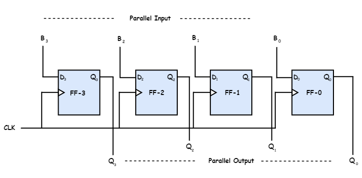

# Parallel Input Parallel Output
{: .no_toc }

## Introduction
 
Parallel Input Parallel Output is also called as Storage register or Buffer register.
In this mode, the 4 bit binary input B0, B1, B2, B3 is applied to the data inputs D0, D1, D2, D3 respectively of the four flip-flops in parallel manner. 
When a negative clock edge is applied, the input binary bits will be stacked into the flip-flops. 
The input given will be equal to the output.
Clock pulse is essential to stack all of the bits.

## Block Diagram

