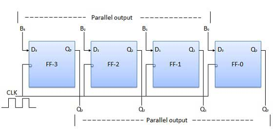

# Parallel-in parallel-out
{: .no_toc }

## Table of contents
{: .no_toc .text-delta }

1. TOC
{:toc}

## Introduction
 
Here, the 4-bit binary datda inputs B0, B1, B2, B3 are applied to the data inputs D0, D1, D2, D3, respectively, of the four flip-flops. 
When a negative edge of the clock is triggered, then the flip-flops get loaded with the input binary bits simultaneously. 
The loaded bits appear at the output side, simultaneously, as well. 
Only the clock pulse is essential to load all the binary bits.

## Block diagram

<iframe width="100%" height="400px" src="https://circuitverse.org/simulator/embed/93890" id="pp_01" scrolling="no" webkitAllowFullScreen mozAllowFullScreen allowFullScreen> </iframe>

