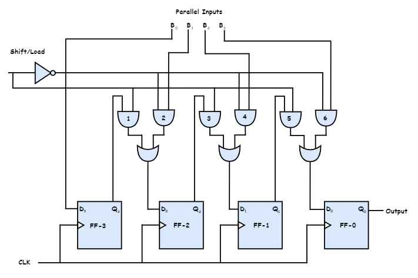

# Parallel Input Serial Output 
{: .no_toc }

## Introduction
 
* Data bits are entered in parallel manner.

* The circuit shown below is a four bit parallel input serial output register.

* Output of previous Flip Flop is connected to the input of the next flip flop via a combinational circuit.

* The binary input word B0, B1, B2, B3 is applied though the same combinational circuit.

* There are two modes in which this circuit can work. They are:

1. Load mode.
2. Shift mode

## Load mode
In this mode, we  will load the data in each of the flip flop simultaneously.
When the shift/load bar line is low (0) loading takes place.
The AND gate 2, 4 and 6 will become active and they will pass B1, B2, B3 bits to the corresponding flip-flops. 
On the low going edge of clock, the binary input B0, B1, B2, B3 will get loaded into the relating flip-flops. 
Thus parallel loading takes place.

## Shift mode
When the shift/load bar line is low (1) shifting takes place.
The AND gate 2, 4 and 6 will become inactive. 
Hence the parallel loading of the data cannot take place. 
But the AND gate 1,3 and 5 become active. 
Therefore the shifting of data takes place from left to right on application of clock pulse. 
Thus the parallel in serial out operation takes place.

## Block Diagram

