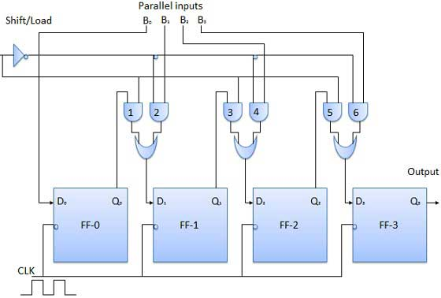

# Parallel-in serial-out 
{: .no_toc }

## Table of contents
{: .no_toc .text-delta }

1. TOC
{:toc}

## Introduction

 
* Data bits enter in a parallel fashion.

* The circuit, shown below, is a four-bit parallel-in serial-out register.

* Output of the previous flip Flop is connected to the input of the next one via a combinational circuit.

* The binary input data bits B0, B1, B2, B3 are applied through the same combinational logic circuit.

* There are two modes in which this circuit can work, namely - shift mode and load mode.

## Load mode

When the shift/load bar line is low (0), the AND gates 2, 4 and 6 become active, and they will pass B1, B2, B3 bits to the corresponding flip-flops. 
On the low going edge of the clock, the binary inputs B0, B1, B2, B3 will get loaded into the corresponding flip-flops. 
Thus, the parallel loading takes place.

## Shift mode
When the shift/load bar line is low (1), the AND gates 2, 4 and 6 become inactive. 
Hence, the parallel loading of the data becomes impossible. 
But the AND gates 1,3 and 5 become active. 
Therefore the shifting of data takes place from left-to-right bit-by-bit on the application of clock pulses. 
Thus, the parallel-in serial-out operation takes place.

## Block diagram

<iframe width="100%" height="400px" src="https://circuitverse.org/simulator/embed/93910" id="ps_01" scrolling="no" webkitAllowFullScreen mozAllowFullScreen allowFullScreen> </iframe>

