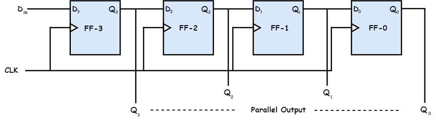

# Serial Input Parallel Output
{: .no_toc }

## Introduction
 
* The data is entered into the register serially while it is taken from it in parallel-fashion.

* Data is loaded bit by bit at a time. The outputs are disabled as long as the data is loading.

* As soon as the data loading gets completed, all the flip-flops contain their required data, the outputs are enabled so that all the loaded data is made available over all the output lines at the same time.

* To load a 4 bit word, 4 clock cycles are required. Hence the speed of operation of SIPO mode is same as that of SISO mode.

## Block Diagram

