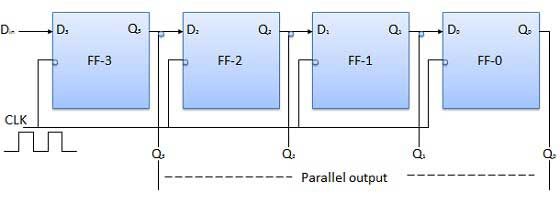

# Serial Input Parallel Output
{: .no_toc }

## Table of contents
{: .no_toc .text-delta }

1. TOC
{:toc}

## Introduction

* In such types of operations, the data is entered serially and taken out in parallel fashion.

* Data is loaded bit-by-bit. The output(s) are disabled as long as the data is loading.

* As soon as the data loading gets completed, all the flip-flops contain their required data. The output(s) are enabled so that all the loaded data is made available over all the output lines at the same time.

* 4 clock cycles are required to load a four-bit word. Hence the speed of operation of SIPO mode is the same as that of the SISO mode.

## Block Diagram

<iframe width="100%" height="400px" src="https://circuitverse.org/simulator/embed/93880" id="projectPreview" scrolling="no" webkitAllowFullScreen mozAllowFullScreen allowFullScreen> </iframe>

